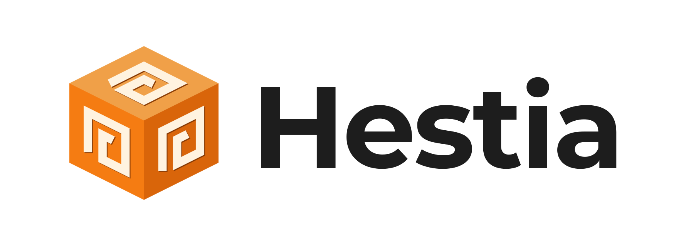
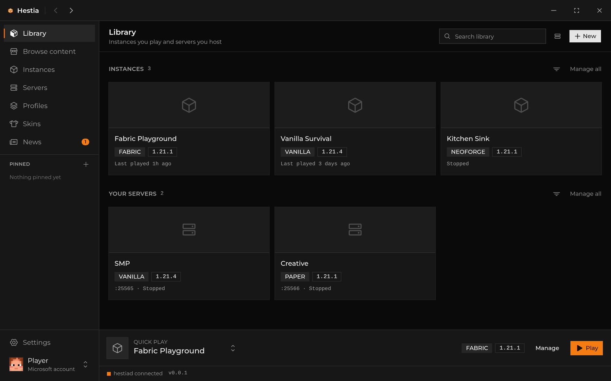
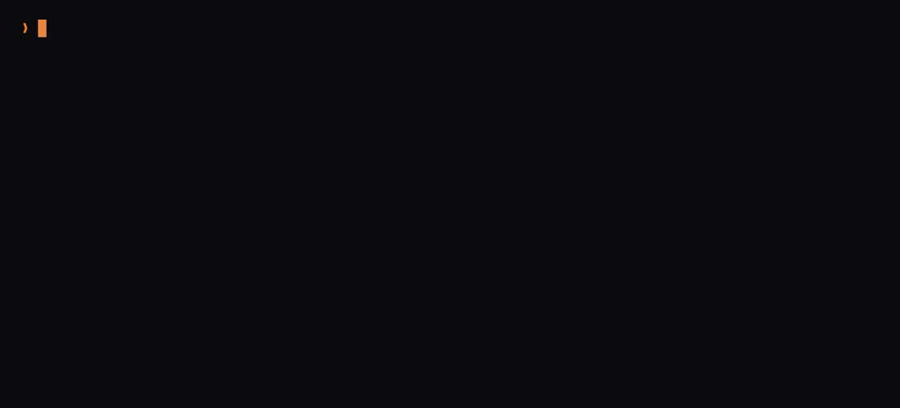
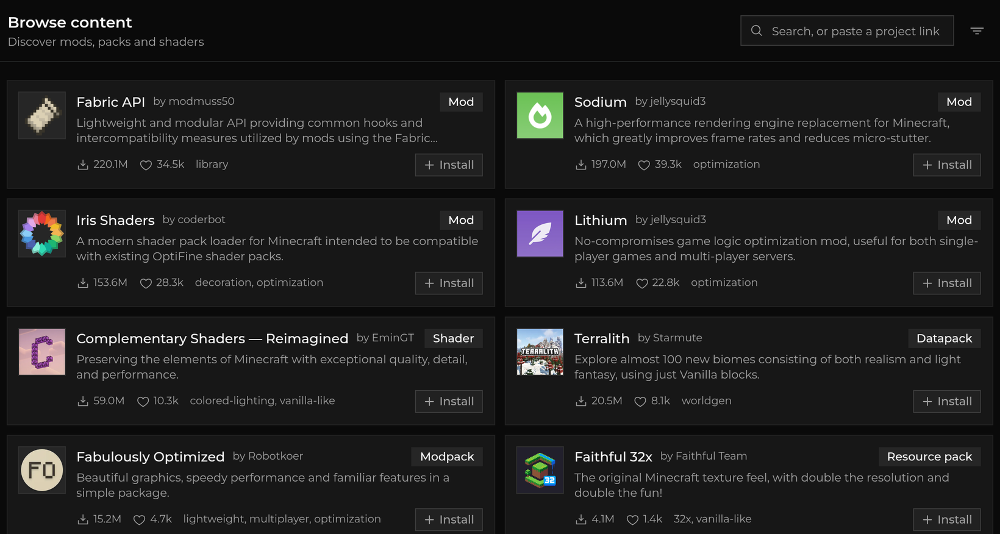
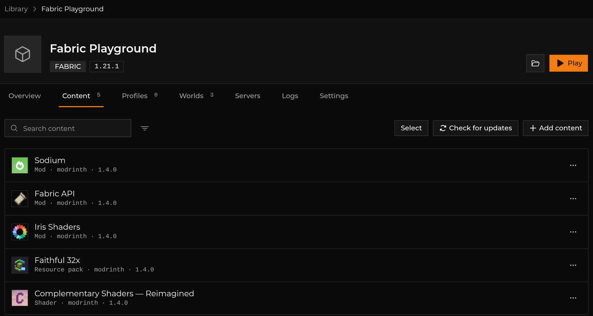
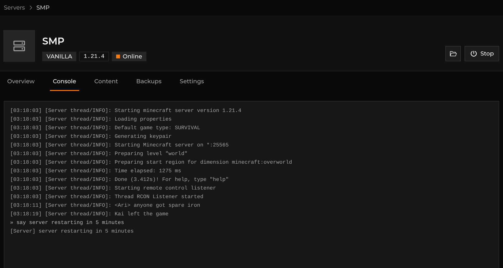
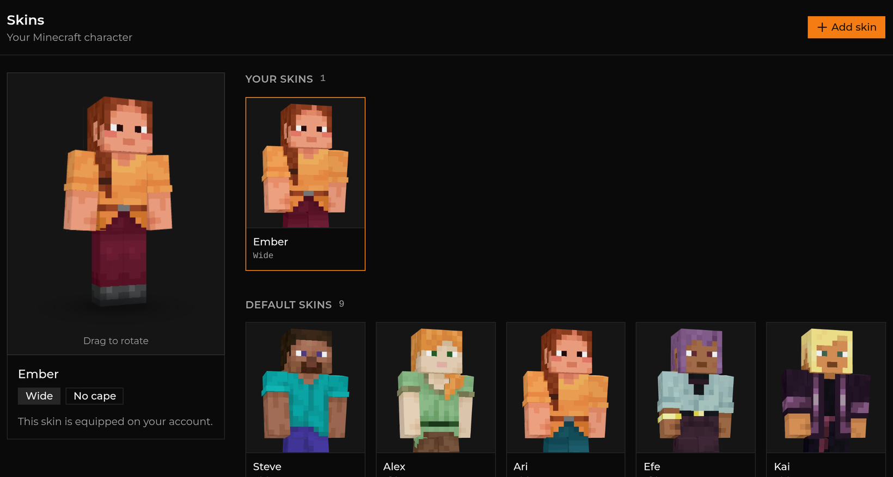

<p align="center">
  <picture>
    <source media="(prefers-color-scheme: dark)" srcset="assets/hero/hero-dark.png">
    
  </picture>
</p>

<p align="center">
  <b>A Minecraft launcher for people who also live in a terminal.</b><br>
  Play instances, host servers, and manage mods — from a window or a shell.
</p>

<p align="center">
  <a href="https://github.com/toraaoo/hestia/releases/latest"></a>
  <a href="https://github.com/toraaoo/hestia/actions/workflows/ci.yml"></a>
  
  <a href="LICENSE"></a>
</p>

<p align="center">
  
</p>

Hestia keeps your instances and your servers in one place. Sign in once, create a modded instance, install mods from
Modrinth or CurseForge, host a server your friends can join, and move any of it between game versions without rebuilding
it.

Underneath, a small resident daemon owns everything — so your server keeps running when you close the window, and the
desktop app and the CLI are just two views of the same state.

## The CLI is not an afterthought

Everything the app can do, `hestia` can do. Create a server, watch it boot on its own RCON-backed console, send it a
command, and walk away — it keeps running.

<p align="center">
  
</p>

Content works the same way. Mods, shaders, resource packs and data packs install from Modrinth or CurseForge with their
dependencies resolved.

<p align="center">
  
</p>

The grammar is entry-first — name the thing, then say what to do to it:

```bash
hestia server smp config set memory 4G     # applies from the next start
hestia server smp backup create            # archive the world + config
hestia instance modded mod add sodium      # install a mod, deps resolved
```

## And the app is not a wrapper

**Find it.** Mods, plugins, resource packs, shaders, data packs and whole modpacks from Modrinth or CurseForge — or
paste a project link and it resolves.

<p align="center">
  
</p>

**Keep it.** Everything installed lands in one pool you can update in place and slice into named profiles.

<p align="center">
  
</p>

**Host it.** A server is fully provisioned at create — jar, Java runtime, EULA, its own port — with live resource
charts, backups on demand or on a schedule, and a console over RCON.

<p align="center">
  
</p>

**Look the part.** A skin library with a real-time 3D preview, the vanilla characters, and your capes — applied straight
to your account.

<p align="center">
  
</p>

## What it supports

| Area          | What works                                                         |
|:--------------|:-------------------------------------------------------------------|
| **Instances** | Vanilla · Fabric · NeoForge                                        |
| **Servers**   | Vanilla · Fabric · NeoForge · Paper · Folia · Spigot · CraftBukkit |
| **Content**   | Modrinth · CurseForge · a page URL · a local file                  |
| **Import**    | Hestia archives · `.mrpack` · Prism / MultiMC instances            |
| **Export**    | Hestia archives · `.mrpack`                                        |

NeoForge builds its game jar locally from the installer, and Spigot/CraftBukkit compile on your machine with SpigotMC's
BuildTools (needs `git`) — so a first create on those takes a few minutes. CurseForge needs an API key
(`hestia config set content.curseforge-key`); the source isn't offered until one resolves.

A few more things it does: several concurrent sessions of one instance, starting straight into a world or onto a server,
in-place version changes both ways (downgrades warn, and a server is backed up first), settings and worlds shared across
instances, a system tray, and self-update.

**Not built yet:** natives extraction for pre-1.19 clients, and the legacy asset layout — very old versions won't launch
correctly.

## Install

Grab an installer from the [latest release](https://github.com/toraaoo/hestia/releases/latest). One download installs
everything: the desktop app, the daemon, the tray, and the
`hestia` CLI.

| Platform             | Formats                                         |
|----------------------|-------------------------------------------------|
| **Linux** (x86_64)   | `.deb` · `.rpm` · AppImage · portable `.tar.gz` |
| **Windows** (x86_64) | `.exe` (NSIS) · `.msi` · portable `.zip`        |

The Windows installer lets you deselect components and puts the CLI on `PATH`. The desktop app updates itself from the
release feed.

<details>
<summary><b>Or build it from source</b></summary>

The daemon and CLI need nothing but a Rust toolchain:

```bash
git clone https://github.com/toraaoo/hestia && cd hestia
cargo build --release -p cli -p daemon
```

The desktop app also needs the system webview (WebKitGTK on Linux, WebView2 on Windows) and [Bun](https://bun.sh/):

```bash
cargo install tauri-cli --version '^2'
(cd frontend && bun install)
(cd crates/desktop && cargo tauri build)
```

`scripts/` wraps all of it — `scripts/build.sh`, `scripts/run.sh`,
`scripts/package.sh`. See [docs/packaging.md](docs/packaging.md).

</details>

## Quick start

```bash
hestia account login              # sign in (Microsoft device-code flow)
hestia instance create            # interactive: flavor → version
hestia play                       # launch it
```

Servers and instances share the same verbs:

```bash
hestia server create              # interactive: flavor → version → EULA
hestia start <name>               # start a server or launch an instance
hestia stop <name>                # stop whichever it is
hestia logs <name> -f             # follow its captured output
```

The daemon is never started behind your back — `hestia daemon start` (or the login autostart) brings it up, and commands
tell you when it's down.

Your data lives in `~/.hestia` (`%APPDATA%\Hestia` on Windows), overridable with
`--home`, `$HESTIA_HOME`, or `hestia config set home`.

**[The full command reference →](docs/cli.md)**

## Documentation

| Page                                         | What's in it                                                                       |
|----------------------------------------------|------------------------------------------------------------------------------------|
| [docs/cli.md](docs/cli.md)                   | every `hestia` command                                                             |
| [docs/architecture.md](docs/architecture.md) | how it's put together — the daemon boundary, the crate graph, a page per subsystem |
| [docs/decisions/](docs/decisions/README.md)  | why it's put together that way                                                     |
| [docs/contributing.md](docs/contributing.md) | conventions and copy-and-adapt recipes                                             |
| [docs/packaging.md](docs/packaging.md)       | installers and release artifacts                                                   |

Contributions are welcome — [docs/contributing.md](docs/contributing.md) has the wire-in recipes, and adding a feature
is usually one line in each of five places.

## License

[GPL-3.0-only](LICENSE) © 2026 toraaoo — published by [prytaneum](https://github.com/prytaneum)

The desktop skin preview and its thumbnail renderer are ported from
[Modrinth's launcher](https://github.com/modrinth/code) (GPL-3.0-only, © Rinth, Inc.) — the reason Hestia is GPL rather
than MIT.
