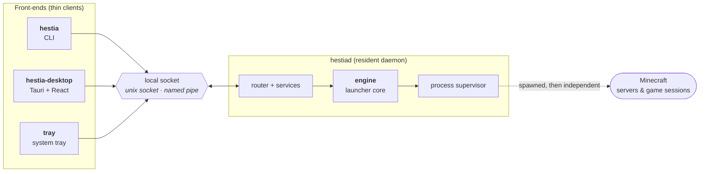
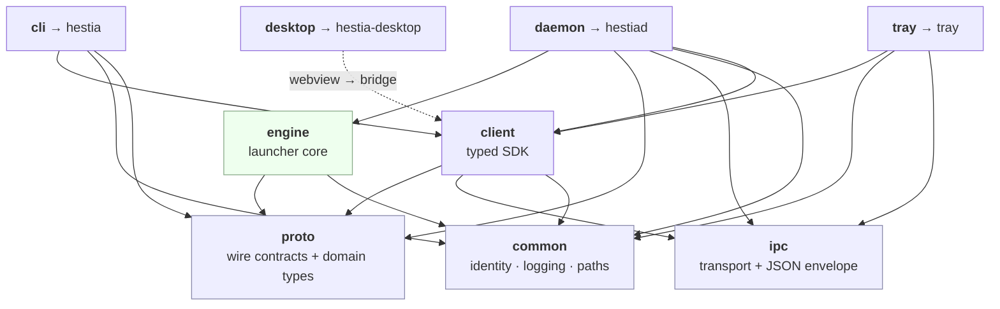
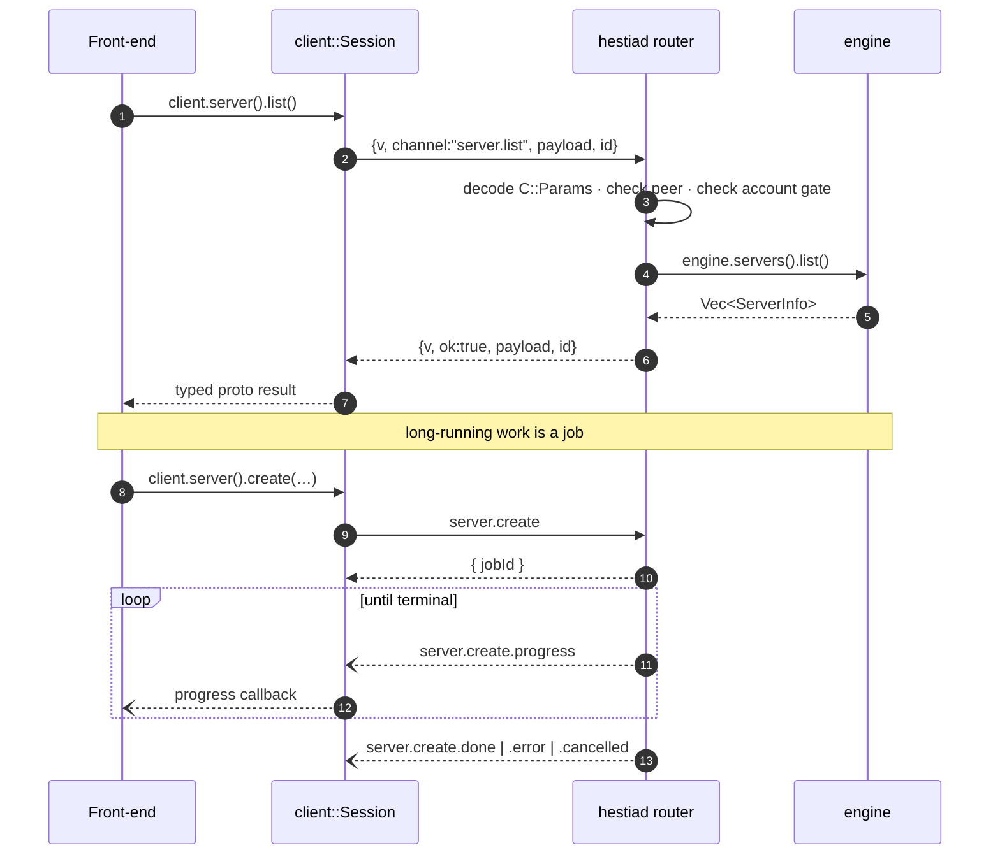

# Architecture

Hestia is a Minecraft launcher built as **one resident daemon with several thin
front-ends**. This page is the map: what the system is, how the pieces fit, and
where to read further. Each subsystem has its own page; the reasoning behind
every non-trivial choice lives in [decisions/](decisions/README.md).

- New to the codebase? Read this page, then the subsystem you're touching.
- Extending it? [contributing.md](contributing.md) has the copy-and-adapt recipes.
- Driving it? [cli.md](cli.md) is the command reference.

## The shape of it

The launcher core — accounts, downloads, Java runtimes, servers, instances,
content — is a Rust library called the **engine**. It is owned by a single
long-lived process, `hestiad`, and it is never linked into anything the user
looks at. Every front-end is a thin client that talks to that daemon over a
local socket.



Three properties follow from that shape, and most of the design is downstream of
them:

- **One core, many faces.** Business rules exist once. A server created from the
  CLI is the same server the desktop lists, with no second implementation to
  drift.
- **The boundary is enforced by the compiler, not by discipline.** Only the
  daemon crate depends on the engine, so a front-end *cannot* reach launcher
  logic except over the wire. `cargo tree -i engine` shows exactly one consumer.
- **Workloads outlive the launcher.** A running server or game session is not a
  child the daemon kills on exit. Stopping one is always something you asked
  for — see [0037](decisions/0037-workloads-outlive-the-daemon.md).

| Front-end | Binary | Stack | What it is for |
|---|---|---|---|
| CLI | `hestia` | clap + ratatui | scripting and terminal use; the fully-wired reference front-end |
| Desktop | `hestia-desktop` | Tauri v2 + React/Vite | the visual surface — library, entries, content browse, skins |
| Tray | `tray` | tray-icon + tao | status and quick actions beside every serving daemon |

## The crate graph

One cargo workspace under `crates/*`. Arrows are dependencies; the absence of an
arrow is the guarantee.



- **`proto`** is the *what* — typed payloads, one definition per channel, shared
  verbatim by both sides. **`ipc`** is the *how* — framing, the envelope, where
  the socket lives. Neither knows anything launcher-specific.
- **`client`** re-exports `proto`, so a front-end takes one dependency and gets
  both the SDK and the domain types.
- **`engine`** never links `ipc` or `client`. It does not know a socket exists —
  the equivalent of Tailscale's `LocalBackend`.
- **`daemon`** is the only crate linking `engine`. It also links `client`, purely
  so `hestiad ping` can talk to an already-running daemon.

## A request, end to end

Every interaction crosses the same seam. A plain call is request/response; a
long-running one answers immediately with a job id and streams progress.



## Where things live on disk

The data home separates what is *yours* from what the launcher can regenerate.
It resolves as `--home` → `$HESTIA_HOME` → a persisted pointer (`config set
home`) → the platform default (`~/.hestia`, `%APPDATA%\Hestia` on Windows).
Debug builds anchor at `<workspace>/.hestia` so development never touches your
real directory.

```
<data_home>/
├── config.json          settings
├── accounts.json        signed-in accounts (owner-only)
├── servers/<id>/        one directory per server   ── yours
├── instances/<id>/      one directory per instance ──
├── skins/               the skin library
├── profiles/            global content profiles
├── shared/              the linked/copied instance store (sync)
├── java/                installed Java runtimes
├── meta/                materialised game files — regenerable
│   ├── versions/ libraries/ assets/ natives/
│   └── spigot/          the shared BuildTools work tree
├── cache/               content-addressed download cache
├── processes/           supervisor records + captured logs
└── logs/                daemon, CLI and desktop logs; crash reports
```

Everything under `meta/` and `cache/` is derived and re-downloadable — one
obvious unit to reclaim ([0057](decisions/0057-meta-root-for-materialised-files.md)).

## Subsystem pages

| Page | Covers |
|---|---|
| [The socket boundary](architecture/wire.md) | `proto` contracts, the `ipc` envelope, the `client` SDK, jobs, events, cancellation, warnings |
| [Cross-cutting foundations](architecture/common.md) | app identity, logging, crash reports, path resolution |
| [The engine](architecture/engine.md) | the aggregate root, config, cache, downloads, Java, the process supervisor, announcements, self-update |
| [The daemon](architecture/daemon.md) | the serve loop, router, runtime, job managers, service registrars, autostart |
| [Minecraft providers](architecture/minecraft.md) | flavors, version catalogues, profile resolution, materialize, launch plans, RCON |
| [Servers & instances](architecture/entries.md) | entry stores, directory layout, provisioning, ports, backups, sync, worlds |
| [Content & modpacks](architecture/content.md) | content sources, the managed-dir install model, datapacks, content profiles, modpacks |
| [Accounts & skins](architecture/accounts.md) | Microsoft sign-in, token rotation, the skin library |
| [Front-ends](architecture/frontends.md) | CLI grammar and presentation, the desktop bridge and query layer, the tray |

## Project status

Hestia is in early development (`v0.0.1`), but the vertical slice is complete:
every capability below works end to end, from the wire contract to at least one
front-end.

**Working:** the workspace and its enforced dependency graph · logging, identity
and path resolution · the wire protocol and typed SDK · config, cache and
downloads · Java runtime management · Microsoft sign-in with token rotation ·
skin and cape management · the process supervisor · the provider layer (vanilla,
fabric, neoforge on both sides; paper, folia, spigot, bukkit for servers) ·
server management with an RCON console · instance management with concurrent
sessions · in-place version updates both ways · server backups, on demand and
scheduled · content install and management from Modrinth, a URL or a local file ·
modpacks into a new or existing entry · per-instance content profiles and global
profiles · shared instance settings and worlds (`sync`) · signed announcements ·
self-update · the CLI over all of it · the desktop shell and its pages · the
system tray.

**Not built yet:**

| Gap | Consequence |
|---|---|
| natives-classifier extraction for pre-1.19 clients | old versions launch without their LWJGL natives |
| the legacy (virtual) asset layout | very old versions have no assets materialized |
| instance import/export | instance data has **no backup story at all** — this is the intended replacement for instance backups, which is why they do not exist |

## Conventions that hold everywhere

- **The disk is the registry.** Java runtimes, backups, servers, instances,
  global profiles and finished processes are all discovered by scanning a
  directory, not by consulting a separate index that can disagree with it.
- **Write through a temp, rename to commit.** Downloads, backups and installs
  stage to `.part`/`.staging` and rename on success, so a failure leaves nothing
  half-written — and a restart reclaims anything abandoned
  ([0027](decisions/0027-temp-artifacts-are-reclaimed-at-startup.md)).
- **Validate at the edge.** Payloads decode through the contract; the config
  schema rejects unknown keys; paths from a client are checked for escape.
- **Wire-in is one line, in one place** — but that place is a module *directory*,
  never a growing file
  ([0034](decisions/0034-an-aggregation-point-is-a-directory.md)).
- **Errors are typed.** `thiserror` enums in libraries, mapped to an
  `ipc::errors` code at the service boundary; `anyhow` at binary edges and for
  multi-step engine operations. A degraded-but-successful outcome rides on the
  result as a structured warning, never only in the log
  ([0029](decisions/0029-degraded-outcomes-ride-on-the-result.md)).
- **Never log tokens or secrets.** Access tokens and RCON passwords never reach a
  log line, including the `-vv` wire trace, which reports frame sizes rather than
  contents.

## Tech stack

**Rust** (edition 2021), a cargo workspace kept clean under `rustfmt`,
`clippy -D warnings` and `cargo-deny`.

| Area | Crates |
|---|---|
| Async + transport | [tokio](https://tokio.rs/) |
| Serialization | [serde](https://serde.rs/) / serde_json |
| Logging | [tracing](https://github.com/tokio-rs/tracing), flexi_logger |
| HTTP | [reqwest](https://github.com/seanmonstar/reqwest) (rustls) |
| Crypto | [p256](https://github.com/RustCrypto/elliptic-curves) (Xbox proof keys), sha1/sha2, minisign verification |
| Archives | `tar`+`flate2`, `zip` — all in-process, no shelling out |
| Game data | [fastnbt](https://github.com/owengage/fastnbt) — reading a world's `level.dat` |
| CLI | [clap](https://github.com/clap-rs/clap) + [ratatui](https://ratatui.rs/) |
| Desktop | [Tauri v2](https://tauri.app/) + [React](https://react.dev/)/[Vite](https://vitejs.dev/), built with [Bun](https://bun.sh/); [three.js](https://threejs.org/) for skin previews |
| Tray | [tray-icon](https://github.com/tauri-apps/tray-icon) + [tao](https://github.com/tauri-apps/tao) |

## Testing

| Where | What it pins |
|---|---|
| `crates/proto/tests/` | `wire` and `golden` — the envelope and contract encodings, so a wire change is caught |
| `crates/engine/tests/` | `store` (config/cache/java/server/instance persistence), `auth_oracle` (the sign-in state machine), `process` (tree termination) |
| `crates/engine/src/**` | unit tests beside the code: launch-plan assembly, the Log4Shell-safe session config, sync reconciliation and folder linking, Modrinth mapping and `.mrpack`/URL parsing, version picking, per-flavor accepted kinds, JVM-args precedence, PaperMC and SpigotMC catalogue parsing |
| `crates/daemon/tests/e2e.rs` | a client-to-daemon round trip over a real socket |
| `frontend/tests/` | the message catalogue: locale coverage, placeholder parity, no dead or missing keys |

```bash
cargo build -p cli -p daemon                              # the fast core
cargo clippy --workspace --all-targets -- -D warnings
cargo test --workspace
```

## Recording a decision

When you make a non-trivial architectural choice, write it down in
[decisions/](decisions/README.md) — what changed, why, and what you rejected —
and link it from the subsystem page it explains. The architecture pages stay a
description of the system; the reasoning lives beside them where it can be read
on purpose rather than stumbled over.
