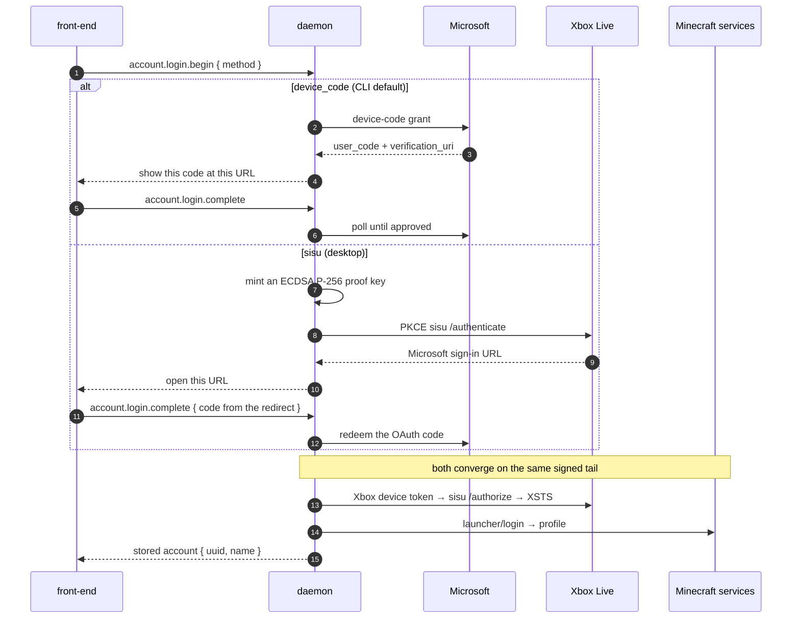
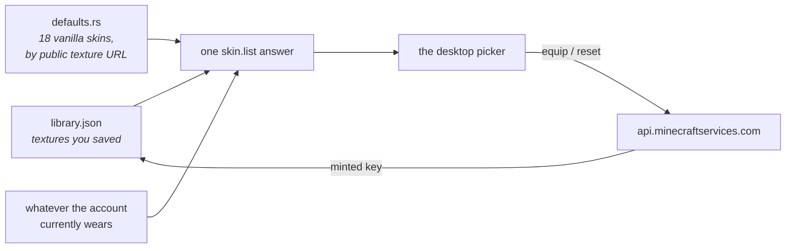

# Accounts & skins

*[← Architecture](../architecture.md)*

Playing Minecraft requires a Microsoft account that owns it. Hestia signs in
through Microsoft's own flows, keeps the tokens in the daemon, and never lets
them cross the socket.

A stored account is also a proof of ownership, which is why the whole
`instance.*` surface is refused until one exists — enforced once, at the router
([0033](../decisions/0033-instance-surface-gated-on-an-account.md)).

## Sign-in

Accounts live in `<data_home>/accounts.json`, owner-only on POSIX. Both methods
use the well-known Minecraft client id, so no per-distribution Azure app is
needed.

Sign-in is two steps, so a front-end can render whatever the user must act on:

The same signed tail runs again on every `access_token()` call, which is how
token rotation works — a launch always gets a fresh token, and the front-end
never sees one.

- `accounts/microsoft.rs` — the HTTP steps (private to the module).
- `accounts/signing.rs` — Xbox request signing: the proof key and the
  FILETIME-stamped `Signature` header, in one cross-platform `p256`
  implementation rather than an OpenSSL/CNG split.

`account.switch` picks the default account launches run as; `account.list`
reports it. The desktop renders each account's player head from that account's
equipped skin texture — blitted locally, so an equip shows at once — and falls
back to the public `api.mineatar.io/face/<uuid>` service, derived from the uuid
rather than round-tripped over the wire, when no texture is loaded yet.

## The skin library

`<data_home>/skins/` holds PNG textures as `<key>.png` blobs beside a
`library.json` index — the disk is the registry, as everywhere else. A row is
keyed by **Mojang's texture hash**, so matching the account's currently equipped
skin at list time is a key comparison rather than an image diff.

**Before any change, the currently equipped skin is preserved** into the library
if neither it nor a default already records it — switching away from an
externally-set skin must never lose it.

The eighteen vanilla defaults (nine characters × two model variants) are listed
by their public texture URLs rather than bundled as PNGs, since Mojang serves
every texture publicly by hash. Equipping one is a by-URL skin change.

`skins/mojang.rs` holds the profile-customization calls — profile fetch,
multipart skin upload, by-URL change, reset, cape set and clear — bearer-authed
with the accounts subsystem's rotated token. A 30-second per-account profile
cache absorbs bursts of `skin.list` reads, because Mojang rate-limits hard; a
change stores the profile its response carries, or drops the entry so the next
read refetches.

Two deliberate departures from the launcher this design otherwise follows:

- **The library is global, not per-account.** A texture is not an entitlement,
  and the equipped state is per-account already.
- **A cape is not bound to a skin.** Mojang's own API models them independently
  (`skins/active` vs `capes/active`), and binding them is what forces a
  reconciliation dance nobody needs.

Changes apply immediately — the daemon is resident, so there is no app-close edge
to flush ([0020](../decisions/0020-skins-follow-modrinth-minus-couplings.md)).

**Skins are a desktop surface only.** Picking a skin is visual, so the CLI
deliberately grows no command for it — one of the documented exceptions to
[every capability getting a verb](../decisions/0044-every-capability-gets-a-verb.md).

## Decisions

- [0020 — Skins follow Modrinth's shape, minus its couplings](../decisions/0020-skins-follow-modrinth-minus-couplings.md)
