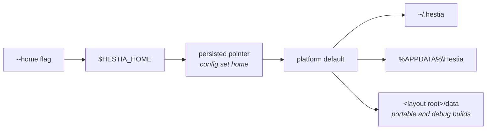

# Cross-cutting foundations

*[← Architecture](../architecture.md)*

`common` is the UI-free, domain-free code every binary links: who the
application is, where its data lives, and how it reports what happened —
including what happened when it crashed.

## Identity

`common::app` holds the application constants — `NAME`, `ID`, `VENDOR`,
`CHANNEL`, `TRAY_ID`, and `VERSION` from `CARGO_PKG_VERSION`. One source of
truth every binary reads, so the product name and version are never hard-coded
twice. `user_agent()` builds the identity for every outbound HTTP request, which
some upstreams now require.

The tray registers under `TRAY_ID` rather than `ID`, because on Linux both
front-ends go through `tao` and would otherwise fight over one D-Bus name
([0055](../decisions/0055-tray-and-desktop-app-ids.md)).

## Where your data lives

`common::paths` resolves the data home in a fixed order, first match wins:

Portable and debug builds anchor at a `data/` directory inside the build's own
layout — `target/<profile>/data` in development — so neither ever populates your
real per-user directory. The anchor is the layout *root*, stepping out of `bin/`
(where a shipped build puts the CLI and the daemon) and `deps/` (where cargo puts
test binaries), so every binary of one build agrees on one home.
`sibling_binary` resolves the others in that layout by the same rule. The module
also provides `config_path`, `log_dir` and `set_persisted_home`.

The data home's layout is in the [architecture overview](../architecture.md#where-things-live-on-disk).
Its organising rule: what you would recognise as *yours* sits at the top level,
and everything the launcher can regenerate sits under `meta/` and `cache/`
([0057](../decisions/0057-meta-root-for-materialised-files.md)).

Note that the **runtime directory** — where the socket lives — is deliberately
somewhere else entirely (see [the socket boundary](wire.md)). One is ephemeral
and per-session; the other is your data.

## Logging

`init_logging(console_level, Option<FileLog>)` configures the process `tracing`
subscriber once, installs the crash hook, and returns a `LogGuard`. Each binary
owns a directory under `<data_home>/logs/<binary>/` and writes up to three
independently filtered sinks:

| Sink | Level | Purpose |
|---|---|---|
| console (stderr) | as requested | gated while a fullscreen CLI surface owns the terminal |
| `latest.log` | Hestia's crates at the file's level, dependencies at warnings | the log you read |
| `debug/latest.log` | every target at trace, dependencies included | the firehose you reconstruct a bug from — resident binaries only (`hestiad`, `desktop`) |

`HESTIA_LOG` overrides every computed directive. Rotation is `flexi_logger`'s:
`latest.log` rolls on the day or 20 MB into dated `YYYY-MM-DD.log.gz` archives
(2 kept plain, 30 gzipped); the firehose rolls at 200 MB (5 gzipped). The layout
follows Minecraft's own `logs/` conventions and Forge's readable/complete split
([0002](../decisions/0002-two-log-files.md)).

**Never log tokens or secrets.** This is not a style preference — the engine
holds Microsoft access tokens and per-server RCON passwords, and neither may
reach a log line. The `-vv` wire trace reports frame *sizes* for the same reason.

## Crash reports

`common::crash` is the panic hook every binary gets from `init_logging`. A panic
is recorded through `tracing` **and** written to `<data_home>/logs/crashes/` as a
standalone report: message, location, backtrace, platform, and the tail of the
live log.

This matters because most Hestia processes have nowhere to print. The daemon's
stderr is detached, a release desktop build has `windows_subsystem = "windows"`,
and a panic inside a spawned task goes where nobody looks — so without this, a
crash left nothing but a missing process
([0003](../decisions/0003-crash-reports-survive-the-process.md)).

- `record()` is the same path for a crash that never touched the Rust stack — the
  desktop's webview errors, where a React render failure kills the UI without
  panicking anything.
- `list`/`read`/`clear` back the desktop's crash notice. All four binaries share
  one directory, so the desktop can surface a *daemon* crash it never saw.
- `read` only opens paths the module itself wrote.

Release builds use `panic = "abort"` with `strip = true`, which leaves release
backtraces as bare addresses.

## Time

`common::time` provides local-time stamps for log lines and report names, via
`chrono`. Backup archives are the deliberate exception — they are named in UTC,
so a stored archive sorts identically wherever it is read.

## Decisions

- [0002 — Two log files, because one file cannot be both readable and complete](../decisions/0002-two-log-files.md)
- [0003 — A crash must survive the process that had no console](../decisions/0003-crash-reports-survive-the-process.md)
- [0057 — Materialised game files live under one `meta/` root](../decisions/0057-meta-root-for-materialised-files.md)
