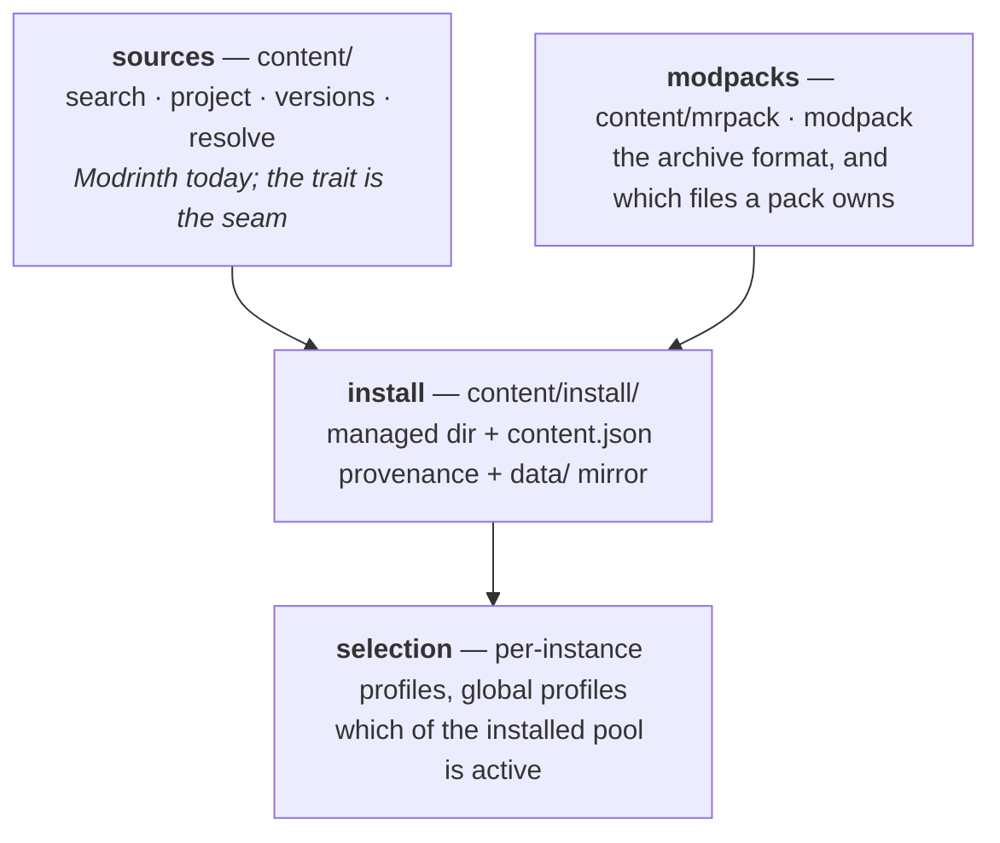
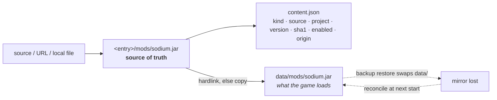
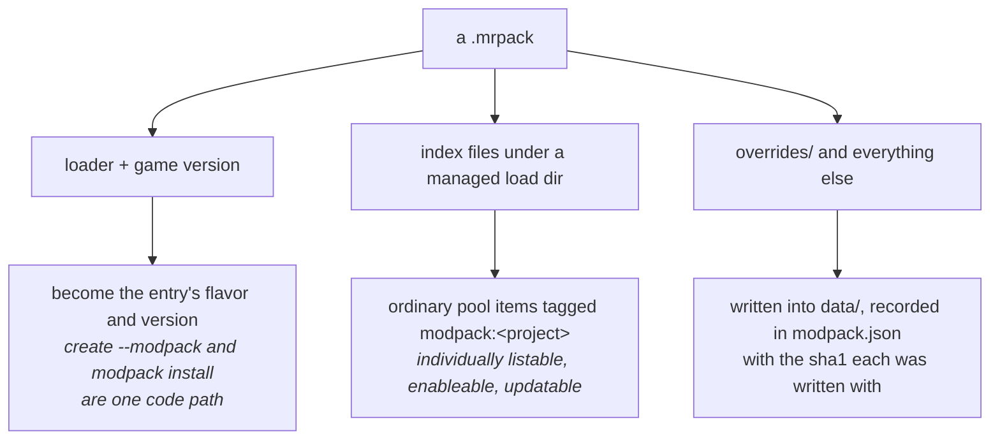

# Content & modpacks

*[← Architecture](../architecture.md)*

Content is everything you add to an entry that Mojang did not ship: mods,
plugins, resourcepacks, shaders, datapacks — and modpacks, which are all of the
above bundled with a loader and a version.

Three layers, deliberately separate:

## Sources

`ContentProvider` is the trait: search with pagination, project detail, version
resolution filtered by loader and game version, modpack resolution, URL
recognition, the kinds a source catalogues, and whether it is configured enough
to serve. `modrinth` and `curseforge` are the shipped sources — adding one is a
new impl plus one line in `Content::new`, the same shape as the flavor registry.
Stateless but for the API keys `configure()` hands down.

Every platform response is mapped into the normalized `proto::content` types at
this boundary, so a front-end never sees a platform's raw shape
([0010](../decisions/0010-one-content-provider-trait.md)).

A provider also recognises its own site's project and version page URLs, so a
pasted `modrinth.com/mod/…` or `curseforge.com/minecraft/…` link installs exactly
like a slug.

> **A second source pays for the trait — and it is only offered when it can
> serve.** CurseForge is the impl the `ContentProvider` seam was written for, and
> it arrived carrying every asymmetry a normalized trait exists to absorb: it
> keys projects by *class* rather than project type (no plugins — the API stopped
> serving class 5, so Hestia does not list a kind that returns nothing), models
> only modloaders (so a datapack's files name no loader at all, and the version
> pick's `datapack` pseudo-loader is stamped on from the class the request already
> named), publishes no per-project side support, has no created-at ordering (so
> "newest" and "recently updated" both resolve to `LastUpdated`), and wraps every
> response in `data`. None of that reaches the rest of the engine — the flows, the
> CLI and the desktop drive both sources through one vocabulary.
>
> The API key makes *availability* a property of a source rather than a constant.
> CurseForge refuses every request without an `x-api-key`, so the trait grew
> `available()` and `configure()`: `content.sources` lists only sources that can
> serve, `content.*` refuses a named-but-unconfigured one with
> `ContentSourceUnavailable` (naming what to set, rather than the "unknown
> source" a filtered registry would have to claim), and a pasted
> `curseforge.com` URL still parses — it is recognised, then refused for the
> reason that is actionable. Resolution is the `content.curseforge-key` setting,
> else a key a distributor baked in at build time
> (`HESTIA_CURSEFORGE_API_KEY`), so official builds can ship one while a source
> build simply has none and the source stays hidden. It is re-applied on every
> `config set` (`Engine::set_config`, the reason that wrapper exists), so a key
> takes effect on the running daemon. The key is never logged — only whether one
> resolved.
>
> Two shapes had to change for it. A `ContentSource` now carries the `kinds` it
> catalogues, because "which sources can I browse mods on" is a daemon fact and a
> front-end must not keep its own table (the same no-drift rule `accepts` follows
> on the entry views). And a `ContentAddItem` may name its **own** source,
> overriding the batch's: with two sources a user's selection is naturally mixed,
> and a spec-wide source would have forced the front-end to split a batch it has
> no other reason to split — a URL item already resolved its own source this way.

> **A blocked file fails its item, and nothing else.** CurseForge lets an author
> opt out of third-party distribution; the API then lists the file with a null
> download URL. The `ContentDownloadBlocked` refusal says so and names the source,
> the rest of the batch installs, and local-file import is the documented way
> through — Hestia deliberately does not reconstruct the CDN path to download it
> anyway. The check lives in `fetch_release` rather than the provider,
> because an artifact with no URL is unusable whoever produced it — and in the
> pack installer for the same reason, where a blocked file is routine rather than
> odd: a CurseForge pack listing one still installs, minus that file, naming it.

## What an entry accepts

Not a table anywhere — composed from two independent facts: what the **flavor's**
loader consumes, and what the **side** reads for itself.

| | mods | plugins | resourcepacks | shaders | datapacks |
|---|:--:|:--:|:--:|:--:|:--:|
| server on a modloader (fabric, neoforge) | ✓ | | | | ✓ |
| server on a platform (paper, folia, spigot, bukkit) | | ✓ | | | ✓ |
| vanilla server | | | | | ✓ |
| instance on a modloader | ✓ | | ✓ | ✓ | ✓ |
| vanilla instance | | | ✓ | ✓ | ✓ |

A refusal carries the accepted set rather than a sentence, and `ServerInfo` /
`InstanceInfo` carry `accepts` on the wire so no front-end keeps its own copy
([0008](../decisions/0008-flavor-declares-accepted-content.md)).

## The install model

Content is written to a **managed directory in the entry root** — Hestia's
namespace — with its provenance in `content.json`, then hardlinked (or copied)
into the game directory.

The managed copy — not the one in `data/` — is the source of truth, which pays
off three ways:

1. **Restore heals itself.** A backup restore swaps `data/`, but the managed dirs
   live outside it and are on the backup exclude list, so a reconcile pass
   re-mirrors them at the next start. Archives stay world-focused.
2. **Provenance survives**, so `update` knows each item's project and current
   version.
3. **A hand-dropped jar is surfaced as untracked**, never silently adopted.

([0013](../decisions/0013-managed-dir-of-record.md))

Managed directory names are the game's own load-dir names (`mods/`, `plugins/`,
`resourcepacks/`, `shaderpacks/`), so the mirror is symmetric.

### Resolution and dependencies

A platform install picks the newest compatible version — filtered by the entry's
game version and, for mods, its loader — and resolves required dependencies
breadth-first. A direct URL or local file import records `source: "file"` with no
version to update against: it installs, it is simply not updatable.

### Who owns which field of a record

An `InstalledContent` mixes three independently-owned groups, and no flow owns
all of them: an install has a project and a version but no prior record, an
update has a record and a version but no project, a modpack re-supply has both
over an item the entry is already holding a particular way.

| Group | Fields | Who writes it |
|---|---|---|
| `Project` | id, slug, title, icon | the install; carried unchanged by everything after |
| `Release` | source, version, filename, sha1, url | an install, an update, a re-supply |
| `Holding` | origin, `enabled`, per-world disables, world targeting | the entry alone — never anything upstream |

`content::record::assemble` is the only place those fields are written, so a
flow cannot reset a group it does not own: an update is `repin(item, release)`
and a modpack re-supply is `rehold(item, holding)`. The assembler is exhaustive,
so a new field on the record does not compile until it has been classified
([0068](../decisions/0068-a-record-is-mutated-not-rebuilt.md)).

This matters beyond bookkeeping: the launch-time mirror reads `enabled` and the
per-world disables straight off the record, so a group lost in a rebuild does
not merely misreport an item — it puts a disabled one back where the game loads
it.

### Beyond add and remove

| Operation | Behaviour |
|---|---|
| `enable` | flips a flag in `content.json`. Enforced at the single point it needs — the launch-time mirror keeps a disabled item out of `data/`, so it can never be resurrected by a restore. A datapack has no mirror, so it uses the standard `.disabled` rename inside its world |
| `check_updates` | a *separate* on-demand call, not baked into `list`, so `list` stays fast and offline |
| `set_version` | re-pins one item to a chosen published version — the update path with an explicit pin instead of "newest" |

All of them refuse a running or busy entry: open jars lock on Windows, and
changes only take effect at the next start anyway
([0014](../decisions/0014-enable-update-check-and-pin.md)).

### Local files are inspected, not trusted

`content.inspect(path)` reads the archive's central directory and classifies it,
returning the detected kind, validity and a reason. Detection is
**loader-agnostic** — a mod is any loader's manifest (`fabric.mod.json`,
`quilt.mod.json`, `META-INF/mods.toml`, `neoforge.mods.toml`, …) — and a datapack
is told from a resourcepack by the `data/` vs `assets/` tree under a shared
`pack.mcmeta`.

The detected kind is a **suggestion, not a verdict**: `content.add` hard-rejects
only what genuinely cannot be single-file content (an unreadable archive, or a
modpack) and otherwise honours the requested kind, so a review-step override
installs where you asked
([0015](../decisions/0015-local-imports-are-inspected.md)).

## Datapacks are the exception

A datapack loads from *inside a world*, not a flat directory — and a world is
already `data/`, which the backup archive captures. So a datapack has no managed
copy and no mirror: it installs straight into its world's `datapacks/`.

| | Server | Instance |
|---|---|---|
| Where | `data/<level-name>/datapacks/` | `data/saves/<world>/datapacks/` |
| Which world | the one, from `server.properties` | named — repeatable `--world`, or an interactive multi-select |

The index keys a datapack by world, so the same pack coexists across several
worlds and a removal clears every copy unless narrowed. Sync skips datapacks
entirely, and the client-side support flag is waived for them: a datapack runs on
a world's server side, including a client's integrated server
([0016](../decisions/0016-datapacks-are-world-of-record.md)).

## Content profiles

An instance's installed pool can be sliced into named **profiles**
(`profiles.json`; absent means no profiles), keyed by filename — the one index
field always present and unique.

A profile is a **selection, not a copy**. The managed dirs stay the single source
of truth; activating a profile changes only what the launch-time reconcile
mirrors into `data/`:

- members are mirrored;
- tracked non-members have their `data/` copy removed (the managed copy stays);
- untracked files are never touched;
- **no profile active mirrors everything** — exactly the pre-profile behaviour,
  so existing instances need no migration.

Selectable kinds are mods, resourcepacks and shaders. Worlds, `servers.dat` and
all other game data are shared across profiles *by construction*: every profile
runs against the same single `data/`. The reserved name `none` overrides an
active profile for one launch ([0017](../decisions/0017-content-profile-is-a-selection.md)).

**Settings capture** is opt-in per profile. An uncaptured profile inherits the
global `shared/` store; `capture` snapshots the settings-class sync targets into
`<instance>/profiles/<name>/`, whose existence *is* the captured flag. Under
linked sync the `config` folder repoints its link into the profile store, while
`options.txt` keeps its per-scope copy-reconcile. `saves` and `screenshots`
always stay global — capture forks *settings*, not game data
([0019](../decisions/0019-profile-settings-capture.md)).

### Global profiles

A different thing with a similar name: a data-home-level `profiles/<name>.json`
is a reusable "starter pack" of **project references** — `{source, project_id,
slug}` — never jars, because jars are version- and loader-specific.

`instance.profile.apply` resolves every reference against the *target* instance's
game version and loader through the ordinary add-content path. Applied content
becomes an ordinary pool item with an `origin` tag (`profile:<name>`), so the
mirror, backup heal, untracked detection and update all work on it unchanged.

Apply is one-shot and additive: a reference already in the pool is skipped, one
with no compatible version is a per-item failure the batch continues past, and
de-listed references are never removed. Removing a profile-tagged item locally is
refused by name — the reference leaves the global profile instead
([0018](../decisions/0018-global-profile-stores-references.md)).

## Modpacks

A pack installs into a new or existing server or instance from a project, a page
URL, or a local `.mrpack`. `pack.rs` owns the *formats* (the `.mrpack` manifest,
and extracting the override trees of either format), deliberately apart from the
platform that serves them — a pack picked off disk has no source and is read the
same way.

**A pack archive knows its own format.** CurseForge modpacks arrive as a zip like
Modrinth's, but with a `manifest.json` that *names* its single overrides tree
instead of `.mrpack`'s fixed `overrides/` + `client-overrides/` +
`server-overrides/`, and with a file list of project/file ids rather than URLs.
Only the second difference needed the platform: `pack.rs` detects which format a
zip is and answers with that format's override trees, so the install flow
extracts either without being told where the archive came from — while the
id-based file list stays in `curseforge.rs`, since resolving those ids into
downloads *is* an API call. A CurseForge pack installed from a **local file** is
refused for exactly that reason, naming it: the archive alone cannot say what its
files are.

A pack decomposes into three things Hestia already has, and each goes where it
belongs:

Only the third needed anything new, and for one reason: those files are configs
and keymaps **you edit**. So an update replaces a file the pack still owns and
leaves a tweaked one exactly as found, reporting which through
`WarningInfo::ModpackOverridesKept`. A *first* install writes over whatever is on
disk — nothing there is yours yet
([0011](../decisions/0011-modpack-decomposes-into-existing-parts.md)).

**Whether there is an update is asked, not assumed.**
`<kind>.modpack.check_update` resolves the pack's newest published version
through the same pick an unpinned update makes, and answers with both version
numbers plus `updatable` — so what a front-end offers and what an update would
install cannot disagree. A pack imported from a file has no catalogue behind it
and answers with nothing to check, the same reason `fetch_update` refuses it.

**A pack's mods are identified for free — or the long way round.** A pack index
names each file by URL and hash alone, with no ids. A Modrinth CDN URL carries
both, so `parse_file_url` recovers them and one bulk call fills in every title and
icon. CurseForge's URLs carry the file id but no project
(`…/files/<id / 1000>/<id % 1000>/<name>`), which would have made every CurseForge
pack a list of anonymous, un-updatable jars. Rather than give up the ids,
`hydrate` looks the **versions** up first and back-fills each reference's project
from the answer, then asks for the projects — so both sources end with an
identified pool and the flow reads the same either way. Best-effort in both
halves: a pack still installs when the catalogue is unreachable, it just reads
less well. A file the source does not serve records as `source: "file"`:
installable, just not updatable.

**A pack's `env.server` is a claim, not a fact.** Packs routinely declare
client-only mods as server-required, so a *server* install filters them using
`itzg/docker-minecraft-server`'s list, adopted verbatim. What is held back rides
on the result as `WarningInfo::ModpackFilesExcluded`, naming each file. The
correction is server-side only — applied to an instance it would strip out
precisely the mods the pack was installed for
([0012](../decisions/0012-pack-server-declarations-are-corrected.md)).

For a CurseForge pack the correction is not a refinement but the *only* signal:
the API publishes no per-project side support, so every required file reads as
wanted by both sides and the exclude table is what tells a server's mods from a
client's. The table's per-pack rules are keyed by the pack's slug, which is
Modrinth's — a CurseForge edition of the same pack matches the global rules but
not its per-pack entry, so `modpack.exclude-files` is the way to correct one.

**What a pack cannot do:** be installed into an entry whose flavor or game
version differs from what it pins, or pin a loader with no Hestia flavor. An
update *does* carry the game version with it — that is what updating a pack means
— behind the same explicit downgrade gate as any version move.

## Decisions

- [0010 — Content is normalized behind one trait](../decisions/0010-one-content-provider-trait.md)
- [0011 — A modpack is three things at once](../decisions/0011-modpack-decomposes-into-existing-parts.md)
- [0012 — A pack's `env.server` is a claim, not a fact](../decisions/0012-pack-server-declarations-are-corrected.md)
- [0013 — Installed content is managed-dir-of-record, mirrored into `data/`](../decisions/0013-managed-dir-of-record.md)
- [0014 — Enable/disable, update-check and pin extend the same model](../decisions/0014-enable-update-check-and-pin.md)
- [0015 — A local-file import is inspected, not trusted](../decisions/0015-local-imports-are-inspected.md)
- [0016 — Datapacks are world-of-record](../decisions/0016-datapacks-are-world-of-record.md)
- [0017 — A content profile is a selection, not a copy](../decisions/0017-content-profile-is-a-selection.md)
- [0018 — A global profile stores project references, never jars](../decisions/0018-global-profile-stores-references.md)
- [0019 — Settings capture is opt-in per profile](../decisions/0019-profile-settings-capture.md)
