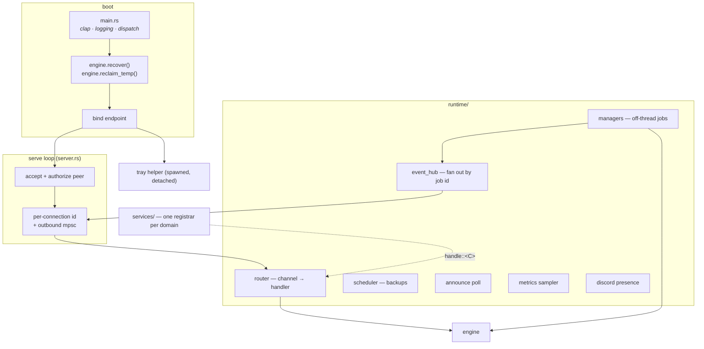
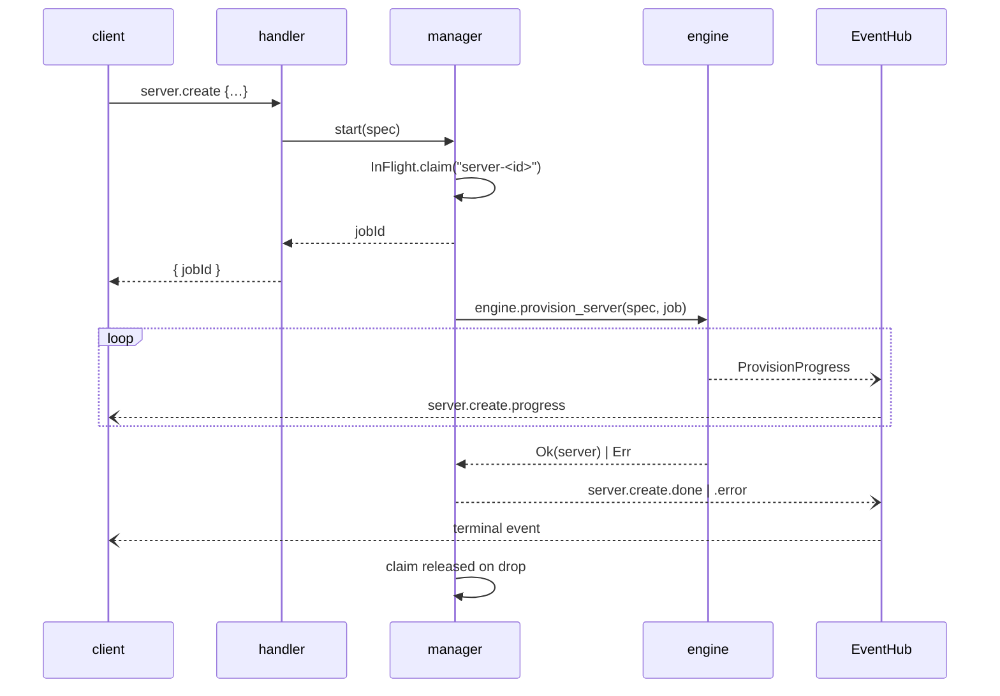

# The daemon

*[← Architecture](../architecture.md)*

`hestiad` is the resident core. It owns the IPC endpoint, routes requests to
handlers, runs the background loops, and manages login autostart. It is the only
crate that links the [engine](engine.md) — which is what makes the front-end
boundary a compile-time fact rather than a convention.

## Bootstrap and the serve loop

**`main.rs`** is bootstrap only: clap parsing (`serve` — the default — plus
`ping` and `stop`), logging init, and dispatch. `hestiad stop` is a graceful
self-stop that leaves supervised processes running, which lets the Windows
installer quiesce the daemon without requiring the CLI.

**`server.rs`** binds the endpoint, then accepts connections, rejecting any peer
that is not `authorized()`. Each connection gets an id and an outbound mpsc
channel drained by a writer task — which is why a streaming channel like
`events.subscribe` is an ordinary handler that simply pushes onto that channel.
The loop runs under `tokio::select!` against a stop request (`daemon.stop`) and
an OS signal (SIGTERM / Ctrl-C).

Once listening, it spawns the tray helper: best-effort, detached, skipped on a
headless session or under `HESTIA_NO_TRAY=1`
([0054](../decisions/0054-the-daemon-spawns-the-tray.md)).

## `runtime/` — the long-lived collaborators

`Runtime` holds the `Engine`, the `EventHub`, the job managers, and the stop
`Notify`. **`HandlerContext`** is what every handler receives:
`{runtime, conn_id, out, peer}` — collaborators through `ctx.runtime.*()`, the
outbound channel for streaming, and the verified peer identity.

### Router

`Router` maps a channel string to a handler; an unknown channel becomes a
well-formed error response. `Channels` is the registrar: `on.handle::<C>(…)`
decodes `C::Params` (a malformed payload answers `bad_request` for you), invokes
the handler, and encodes `C::Result`, mapping a returned `ServiceError` to its
protocol code.

Because the channel name and payload shapes come from the contract, a handler
**physically cannot** drift from the client SDK.

One rule lives at the router rather than in handlers: the whole `instance.*`
surface (plus the instance-only `sync.*`) is refused with `unauthorized` until an
account exists. It is a whole-domain lockdown, and prefixing covers
`instance.content.*` and `instance.profile.*` without touching their modules
([0033](../decisions/0033-instance-surface-gated-on-an-account.md)).

### Job managers

`runtime/managers/` is one module per manager: `DownloadManager`,
`JavaInstallManager`, `ServerCreateManager`, `ServerUpdateManager`,
`InstanceLaunchManager`, `BackupManager`, `ContentManager`, `ModpackManager`,
`UpdateManager`.

They all implement the same pattern: answer the channel immediately with a job
id, run the blocking engine work off-thread, publish progress/done/error events
through the hub.

`managers/job.rs` is the plumbing they share: `topic_event`, the job-id
generator, and **`InFlight<K>`** — the "one job per key" set whose `claim()`
returns a guard released on drop, so a panicking job cannot wedge its key.

The launch managers hand a prepared `LaunchPlan` to the supervisor under a
deterministic process id (`server-<id>`, `instance-<id>_<seq>`), so every channel
can find an entry's process without bookkeeping. That same id doubles as the
in-flight key lifecycle handlers check, so nothing swaps the tree an archive is
reading.

### Background loops

| Loop | Cadence | What it does |
|---|---|---|
| `scheduler.rs` | every minute | archive each **running** server whose `backup-interval` has elapsed since its newest backup, then prune `scheduled` archives beyond `backup-retention`. A stopped server's world cannot change, so it is never re-archived |
| `announce.rs` | at startup, then every six hours (30s in a debug build, where the feed is served off local `news/`) | fetch the feed; publish `announce.changed` when what applies to this build changes. A failed poll publishes nothing — the cached list is still what the daemon serves |
| `metrics.rs` | every 2 s | sample CPU and memory for supervised processes, normalising CPU by logical core count so a multi-threaded JVM reports a share of the machine rather than 800% |
| `presence.rs` | every 5 s, on its own thread | publish Discord Rich Presence — the newest running session, else idle — sending only when the card changed. Gated on `discord.enabled` and skipped entirely under `HESTIA_NO_PRESENCE=1`; a missing Discord client is polled for at a sixth of the rate ([0063](../decisions/0063-discord-presence-is-a-daemon-loop.md)) |

`event_hub.rs` fans events out to subscribed connections, filtered by id, and
unsubscribes them on disconnect.

## `services/` — the wire-in point

One registrar per domain, each registering its channels with one
`on.handle::<C>(…)` apiece. `services/mod.rs`'s `make_router()` is nothing but
the list of `register()` calls; `services/guards.rs` holds the preconditions the
registrars share (`find_server`, `is_running`, `ensure_stopped`,
`ensure_no_backup|update|content`, `require_backup`).

There is no `Service` class per prefix — a handler is a closure, and the grouping
is purely a compile-time one that keeps `make_router()` from becoming a
1100-line function ([0032](../decisions/0032-one-registrar-per-domain.md)).

### The channel surface

| Registrar | Channels |
|---|---|
| `lifecycle` | `health.ping`, `app.info`, `daemon.status\|stop`, `events.subscribe`, `job.cancel` |
| `config` | `config.get\|set\|list` — the reserved `home`/`autostart` keys routed to the path pointer and login registration |
| `cache` | `cache.info\|list\|clear` |
| `java` | `java.releases\|list\|install\|uninstall` |
| `download` | `download.start` |
| `accounts` | `account.login.begin\|login.complete`, `account.list\|switch\|remove` |
| `skins` | `skin.list\|add\|update\|equip\|reset\|remove`, `cape.equip\|clear` |
| `process` | `process.start\|stop\|list\|status\|logs` |
| `server` | `server.flavors\|loaders\|versions\|resolve`, `server.create\|update\|rename\|list\|status\|info\|remove\|start\|stop\|logs\|command\|ping`, `server.config.get\|set\|list` |
| `instance` | the `instance.*` counterparts, plus `instance.launch\|stop\|logs`, `instance.worlds`, `instance.profile.*`, `instance.sync.adopt` |
| `backup` | `server.backup.create\|list\|restore\|remove` |
| `content` | `content.sources\|search\|project\|versions\|inspect\|resolve_url`, `content.modpack.resolve`, and the per-entry `server\|instance.content.add\|list\|remove\|update\|enable\|check_updates\|set_version` |
| `modpack` | `server\|instance.modpack.install\|update\|status\|remove` |
| `profile` | `profile.list\|create\|remove\|edit` — the global reference lists |
| `sync` | `sync.get\|set\|status` |
| `announce` | `announce.list\|dismiss\|refresh` |
| `update` | `update.check\|download` |

Two conventions worth knowing when reading them:

- **Per-entry jobs are split per side** (`server.modpack.*` and
  `instance.modpack.*` rather than one target-tagged channel), so the router's
  account gate covers the instance half by prefix alone.
- **`info` is static, `status` is live.** `info` answers the descriptor, on-disk
  locations and disk footprint (a directory walk); `status` merges the stored
  record with live process state. Keeping the walk off `status` is what makes
  `status` cheap enough to poll.

## Autostart

`autostart/` registers or removes the daemon as a login-time service per
platform (`linux.rs`, `windows.rs`, `unsupported.rs` behind one interface),
driven by the `config` service when the reserved `autostart` key is set.

## Stopping

`daemon.stop` takes a boolean `stop_processes` — and deliberately does *not*
define what a bare "stop the launcher" means when a server is running. That third
meaning, **ask**, lives in the front-end: the CLI prompts on a terminal and
refuses when piped; the tray's Quit and the desktop's stop button both leave
workloads running, because a menu item cannot ask
([0039](../decisions/0039-stopping-the-daemon-has-three-meanings.md)).

On shutdown the daemon calls `stop_all_and_wait()` only when asked to; otherwise
supervised processes simply carry on without it.

## Decisions

- [0032 — One registrar function per domain, not a Service class per prefix](../decisions/0032-one-registrar-per-domain.md)
- [0033 — Instances are gated on a signed-in account, in the router](../decisions/0033-instance-surface-gated-on-an-account.md)
- [0034 — An aggregation point is a directory, not a file](../decisions/0034-an-aggregation-point-is-a-directory.md)
- [0039 — Stopping the daemon has three meanings](../decisions/0039-stopping-the-daemon-has-three-meanings.md)
