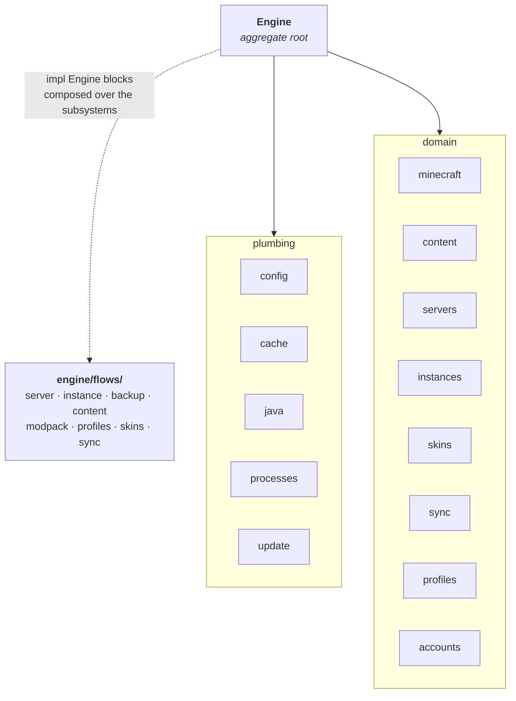
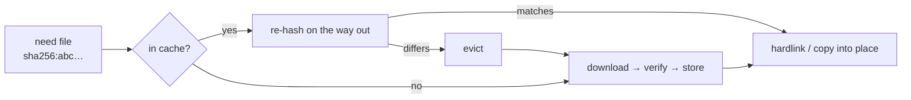
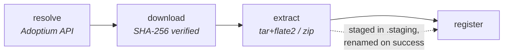
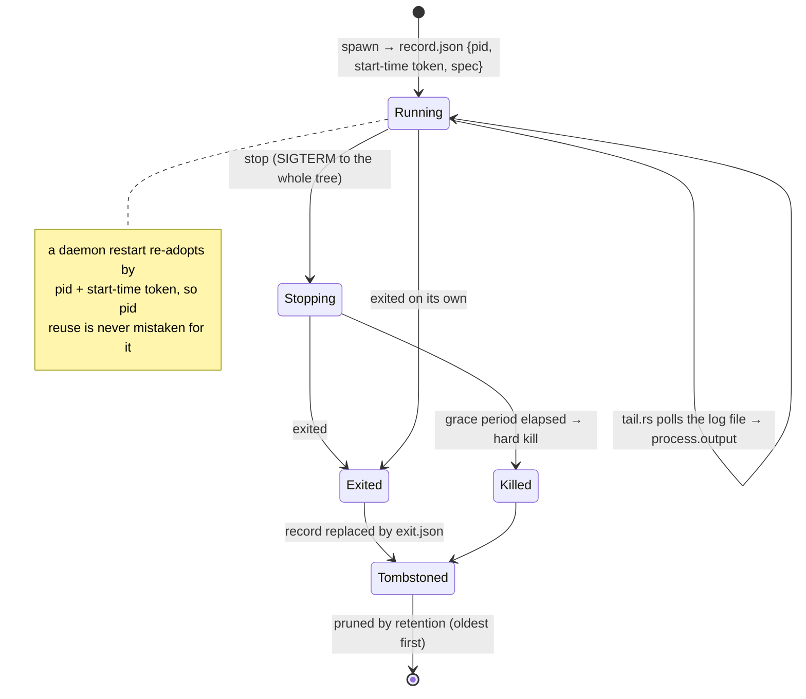

# The engine

*[← Architecture](../architecture.md)*

The engine is the launcher itself: config, downloads, Java runtimes, accounts,
game providers, entry stores, content, process supervision. It is
daemon-internal — it links neither `ipc` nor `client`, and does not know a socket
exists. Front-ends reach it only over the wire.

This page covers the aggregate root and the plumbing subsystems. The bigger
domains have their own pages: [Minecraft providers](minecraft.md),
[Servers & instances](entries.md), [Content & modpacks](content.md),
[Accounts & skins](accounts.md).

## The aggregate root

`Engine` (`engine/mod.rs`) is constructed exactly once by the daemon and threaded
through every request handler. It resolves the data directory once and owns each
subsystem as a member behind a getter — and owns *only* that.

Two rules keep this from becoming a god object:

- **Adding a subsystem is a module, a member and a getter** — the single growth
  point, with no change to the daemon's serve loop.
- **A flow that spans subsystems is not a method on the aggregate.** It lives in
  `engine/flows/<concern>.rs` as its own `impl Engine` block (Rust lets an
  inherent impl span modules in a crate), so callers still write
  `engine.provision_server(…)` while the aggregate stays wiring
  ([0034](../decisions/0034-an-aggregation-point-is-a-directory.md)).

`set_data_home()` re-resolves the directory and `reload()`s every subsystem, so a
`config set home` takes effect on the running daemon rather than the next start.

### Startup reconciliation

No job survives a daemon stop, so anything half-finished on disk at boot belongs
to a job that will never come back. `Engine::recover()` and
`Engine::reclaim_temp()` run before the daemon serves — and again after a
data-home change, since the new home's leftovers are no more claimed than the old
one's.

| Pass | What it settles |
|---|---|
| `ProcessSupervisor::recover()` | re-adopt surviving processes; entomb ones that died while unsupervised |
| server phase reconcile | discard a record still `Provisioning`; keep and log one mid-`Updating` ([0026](../decisions/0026-server-phase-over-a-ready-bool.md)) |
| `reclaim_temp()` | delete abandoned `.part`/`.staging` artifacts, logging the bytes reclaimed ([0027](../decisions/0027-temp-artifacts-are-reclaimed-at-startup.md)) |

The reclaim is deliberately **not** recursive: each subsystem knows the one
directory its artifacts land in, and walking a data home whose asset store is six
figures of files is not a cost to pay at every start.

## Persisted documents — `schema`

Every user-owned file in the data home — the settings, the accounts, an entry's
record, its content index and profiles, the modpack record, the skin library, a
global profile — is a `Document`: it carries a top-level `schemaVersion` and is
read and written through `engine::schema`
([0064](../decisions/0064-a-managed-document-carries-its-schema-version.md)).

| Concern | How |
|---|---|
| Current version | `1 + MIGRATIONS.len()`, derived — adding a migration is appending one function |
| A migration step | rewrites `serde_json::Value`, not the Rust type, so it stays a record of the shape that existed |
| No stamp on the file | the baseline; every step applies |
| Newer than this build, malformed, or failing its migration | renamed to `<name>.unreadable-<stamp>`, defaults used, warning recorded |
| Needs bringing forward | migrated on read and written back, so the disk converges as it is used |
| Writing | temp file renamed into place; owner-only mode set *before* the rename where it matters |

Derived state is deliberately excluded — process records, Java runtime records,
the download cache. Discarding one loses nothing, which is
already what happens when it fails to read.

Quarantines are not caused by the request that hit them, so they collect in one
process-wide sink and surface through `daemon.status` and, for the documents an
import lands, on the import's own result.

Both archive formats are documents under the same rule: the `.hestia` manifest
carries the instance record stamped rather than inlined, and a backup archive
leads with `hestia.backup.json`. An archive is not hestia's to rename aside, so a
schema failure there is refused (`ArchiveUnsupported` / `ArchiveInvalid`) rather
than quarantined.

## Settings — `config`

The schema is one `Settings` struct: a setting is a field with its default,
persisted as JSON through serde. Internal code reads a `settings()` snapshot and
writes through `update()`.

The dotted-path `get`/`set` serve the `config.*` channels and reject unknown keys
and type-mismatched values — **the struct is the validation** — plus a
`normalize()` pass for value rules a type cannot carry (`defaults.memory` and
`defaults.jvm-args` reuse the per-entry validation).

Those JVM defaults fall back into any server start or instance launch whose
record leaves the matching per-entry setting unset (`JavaSettings::or_defaults`).
Two reserved keys are not stored here at all: `home` routes to the path pointer
and `autostart` to the platform login registration.

Keys are kebab-case even though the file stores camelCase — a deliberate,
translated exception ([0031](../decisions/0031-camelcase-except-the-config-vocabulary.md)).

## Downloads and the cache

**`Downloader`** streams a URL to disk through a `.part` temp file, hashing
incrementally when a checksum is given and renaming into place only on success.
It is stateless; the daemon constructs one per download. `checksum.rs` is the
incremental SHA-1/SHA-256 hasher.

**`Cache`** is a content-addressed store of verified downloads under
`<data_home>/cache/<algorithm>/<hex[..2]>/<hex>`, keyed by checksum — so a file
fetched once (a JDK, a library) is reused regardless of which URL asked for it.

Hits are **re-hashed on the way out**, so a damaged blob is evicted and the fetch
falls back to the network. The cache can make things faster; it can never make
them wrong.

## Java runtimes

`Java` installs and tracks runtimes under `<data_home>/java/<vendor>-<major>/`
beside a `runtime.json` record. Listing scans the directory — the disk is the
registry.

`JavaProvider` is the catalogue seam; `adoptium` (Eclipse Temurin) is the shipped
default. `install()` runs a blocking pipeline:

Everything is in-process — no shelling out to system tools — and staging means a
failure leaves nothing behind. The async wrapper and `java.install.*` progress
events live in the daemon's `JavaInstallManager`.

## Process supervision

`ProcessSupervisor` owns every process Hestia starts: Minecraft servers, game
sessions, NeoForge's processor chain, the `server.properties` schema run, a
Spigot build. It lives in the engine — not the daemon — because its directory is
engine-owned like every other registry, and because engine flows that shell out
must not spawn bare children
([0036](../decisions/0036-supervision-is-engine-state.md)).

A supervised process is **decoupled from the daemon's lifetime**: its own process
group (a job object on Windows), no `kill_on_drop`, no pipes back. The daemon is
restartable and upgradable under live workloads, and stopping one is always
something you asked for ([0037](../decisions/0037-workloads-outlive-the-daemon.md)).

**Records and identity.** Each live process has a record under
`<data_home>/processes/<id>/` — `{pid, start-time token, spec}`, owner-only
because the spec can carry launch credentials. `recover()` re-adopts survivors at
the next daemon start, verifying the pid against its start-time token
(`identity.rs`, per platform). An adopted process is not our child, so its exit
is detected by polling and its exit code reports `null`.

**Output lives on disk, not in pipes.** `LogSource::File` points at a log the
process writes itself (Minecraft's `logs/latest.log`; a `jvm.log` catches
pre-log4j stderr); `LogSource::Capture` redirects into a supervisor-owned
`output.log`. Either way `tail.rs` polls the file for `process.output` events and
`process.logs` reads its tail on demand — so log history survives daemon
restarts, and following logs is scoped to the *entry* rather than one run of it
([0040](../decisions/0040-following-logs-is-entry-scoped.md)).

**Stops are polite and reach the tree.** SIGTERM first (the JVM saves and exits),
a hard kill only after a grace period — both addressed at the whole process tree,
never a single pid.

**A finished process is labelled, not merely unrecorded.** On exit the record is
replaced by a tombstone (`exit.json`: state, exit code, when it ended, where its
logs are), so the directory keeps its logs *and* says what it is. The startup
sweep then deletes only directories with **neither** marker — a true stray — and
retention prunes the oldest tombstoned ones
([0038](../decisions/0038-a-finished-process-is-tombstoned.md)).

`task.rs` is the provisioning half: `run(Task, Job)` drives a program to
completion, relays what it narrates as progress, and is cancelled through the
supervisor.

## Self-update

`update/` owns the whole path — the check against the published release manifest
(`latest.json`), the download of the artifact for this platform, its minisign
verification against `update_pubkeys()`, and running it. No front-end does any of
it ([0066](../decisions/0066-the-daemon-owns-self-update.md)).

| Module | What it is |
|---|---|
| `mod.rs` | the manifest, the check, the download, and the guard that `apply` is only ever handed a file this daemon staged |
| `install.rs` | how this copy was installed — NSIS, AppImage, deb, rpm, or unmanaged — detected rather than recorded, since a build that writes it down is wrong the moment someone moves it |
| `apply.rs` | one entry point per platform, so no caller branches on the install shape |

The install shape picks the artifact *and* the installer. A package asks the
manifest's `formats` map for its own format and accepts nothing else — offering a
deb install an AppImage would download something it has no way to apply. The
`portable` feature short-circuits detection to unmanaged: an archive the user
unpacked by hand has no installer to update through.

Network reads are stateless; the staging directory only holds the download.

`version.rs` is the comparison the check rests on: anything unparsable compares
as *no answer*, and every caller treats that as a refusal — a malformed version
cannot trigger an update.

## Small shared pieces

| Module | What it is |
|---|---|
| `cancel.rs` | `Cancel`, the cooperative cancellation flag, and `Job`, which carries it beside the progress reporter — a step that reports progress is exactly a step that can stop between reports |
| `registry.rs` | id allocation (`allocate_id`) and directory naming (`dir_name`) shared by the entry stores ([0023](../decisions/0023-id-is-a-uuid-directory-is-a-slug.md)) |
| `usage.rs` | directory footprint, treating a symlink as a boundary so a linked sync folder is not counted into the instance that points at it |
| `signature.rs` | minisign verification for the updater |
| `error.rs` | the engine's `thiserror` enums, mapped to `ipc::errors` codes at the daemon's service boundary |

## Decisions

- [0027 — A temp artifact is only valid while its job holds the claim](../decisions/0027-temp-artifacts-are-reclaimed-at-startup.md)
- [0036 — Supervision is engine state, and one stop reaches the whole tree](../decisions/0036-supervision-is-engine-state.md)
- [0037 — Workloads outlive the daemon by design](../decisions/0037-workloads-outlive-the-daemon.md)
- [0038 — A finished process is labelled, not merely unrecorded](../decisions/0038-a-finished-process-is-tombstoned.md)
- [0040 — Following logs is scoped to the entry, not to one run of it](../decisions/0040-following-logs-is-entry-scoped.md)
