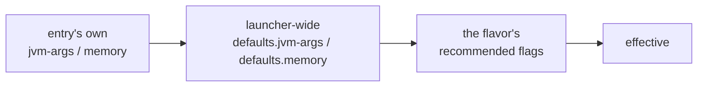
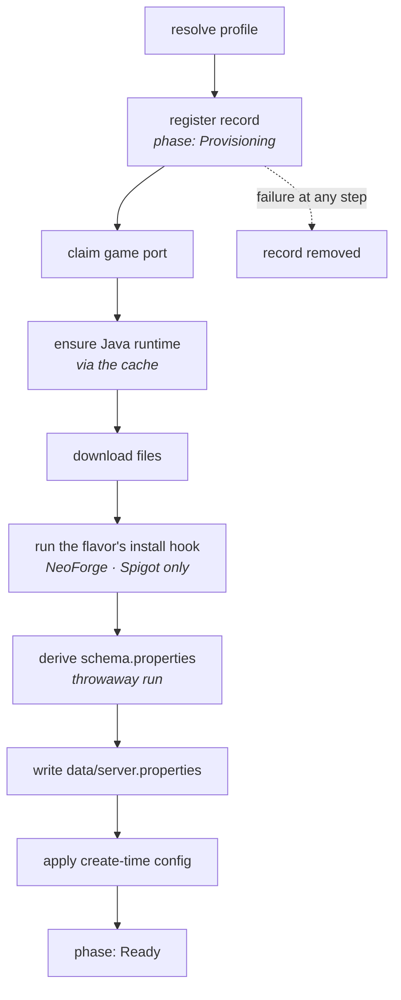
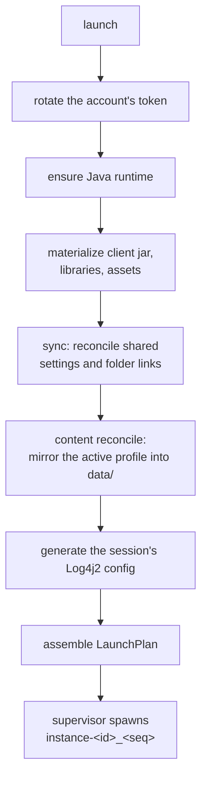
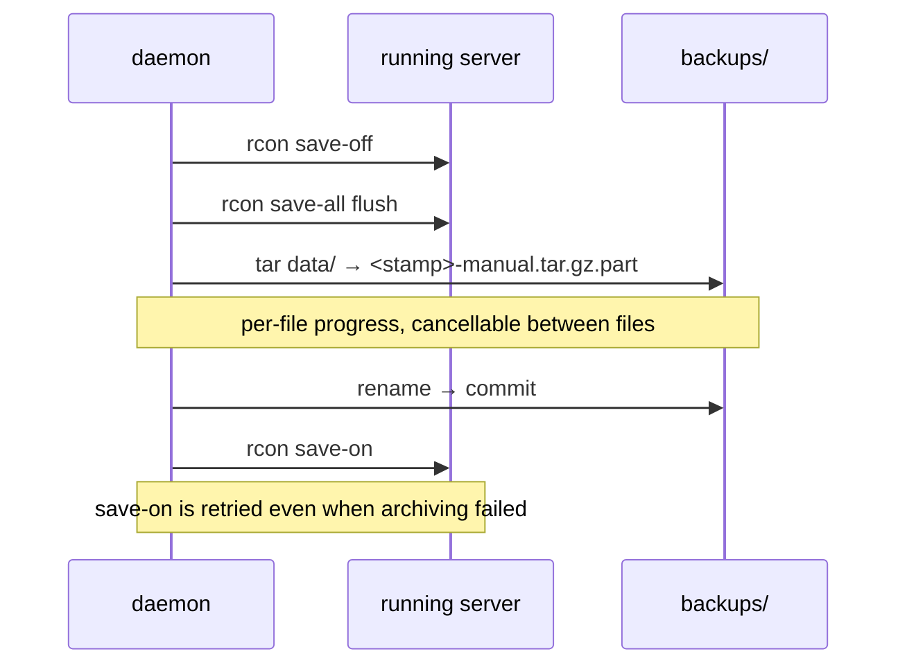
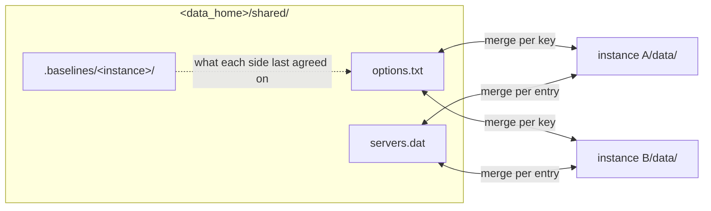

# Servers & instances

*[← Architecture](../architecture.md)*

An **entry** is a server or an instance: a named thing you create, configure,
start and eventually remove. They share most of their machinery — records, ids,
Java settings, content, version updates — and differ in the ways a dedicated
server differs from a game client.

| | Server | Instance |
|---|---|---|
| Provisioned | fully, at create | at each launch |
| Sessions | one (a world has one authoritative writer) | many, opt-in |
| Console | RCON | none |
| Backups | archive/restore + schedule | none — [import/export](transfer.md) instead |
| Shared settings (`sync`) | no, deliberately | yes |
| Content profiles | no | yes |
| Ports | claimed and reconciled | n/a |
| Runs as | itself | the signed-in account |

## The directory layout

The entry root is Hestia's namespace; `data/` is the game's working directory —
exactly what the game reads and writes, and the launch plan's cwd. Splitting them
is what lets Hestia keep its own artifacts without mixing them into files the
game rewrites ([0021](../decisions/0021-entry-root-versus-data-dir.md)).

```
servers/<dir>/                    instances/<dir>/
├── server.json     record        ├── instance.json    record
├── schema.properties            ├── content.json     install index
├── content.json    install index├── profiles.json    content profiles
├── modpack.json    if from a pack├── modpack.json
├── mods/  plugins/ managed      ├── mods/ resourcepacks/ shaderpacks/
├── backups/                     ├── profiles/<name>/  captured settings
│                                ├── logs/session-N.log
└── data/           the game dir  └── data/            the game dir
    server.properties, eula.txt,      saves/, options.txt, config/,
    world/, logs/, libraries/,        screenshots/, logs/,
    mods/ (mirror)                    mods/ (mirror)
```

Directories appear on demand rather than at create, so the tree only shows what
is in use.

## Identity: an opaque id, a readable directory

Two facts pull in opposite directions. An entry's **internal key** must never
change — the supervisor's process key, the port claim, the in-flight key, and the
on-disk `processes/<id>/` records all hang off it. Its **directory** should read
like the entry and track its name.

So they are decoupled: the `id` is a bare UUIDv7 hex string minted at create and
never used as a path component, while the directory is `slugify(name)`. A rename
rewrites the name and *moves the directory*, leaving the id — and everything
keyed by it — untouched ([0023](../decisions/0023-id-is-a-uuid-directory-is-a-slug.md)).

You always address an entry by its **name**, never the id. `proto::naming::reference_matches`
resolves a reference by exact id *or* any spelling that slugs to the display name
— so `My Server`, `my-server` and `MY  SERVER` all hit the one server named "My
Server". That rule lives in `proto`, so the daemon and every front-end resolve
identically.

## Records and settings

`servers/<dir>/server.json` and `instances/<dir>/instance.json` hold the resolved
profile snapshot plus per-entry settings. Listing scans the directory — the disk
is the registry.

| Setting | On | Meaning |
|---|---|---|
| `memory` | both | one value driving both `-Xms` and `-Xmx` |
| `jvm-args` | both | extra JVM arguments |
| `backup-interval` | server | scheduled-backup cadence (m/h/d units; empty disables) |
| `backup-retention` | server | how many `scheduled` archives to keep |

Servers additionally pass any `server.properties` key through `config set` — but
a set must name a key the server's own derived schema carries, and the
Hestia-managed port and RCON keys are rejected outright.

JVM settings resolve in layers, each filling only what the one above left unset:



`server info` names both the effective flags and **which layer supplied them**,
so a process is never running flags nobody can account for.

## Creating a server

A server is a long-lived thing, often driven headless — so `create` pays the
whole cost once, and `start` is an immediate spawn that cannot fail on the
network ([0056](../decisions/0056-server-provisioning-is-front-loaded.md)).



The record is registered **before** provisioning because it is what holds the
port claim through a long download. A record carries a `ServerPhase` —
`Provisioning`, `Ready`, `Updating` — rather than a `ready: bool`, so startup
recovery can tell "nothing here is yours yet" (discard) from "your world is here,
mid-swap" (keep) ([0026](../decisions/0026-server-phase-over-a-ready-bool.md)).

### Ports

A server claims its game port at create (lowest free from 25565, or pinned) and
its RCON console — port plus a random password — at first start. Claims are
checked against every other record **plus a live bind probe** under one
allocation lock, so concurrent creates can never collide.
`ensure_start_config` reconciles them into `server.properties` before each spawn,
preserving your edits.

RCON has no bind-address setting in vanilla, so the listener is network
reachable; the per-server random password is the only barrier, and it never
appears in a log.

### The properties schema

`config set` validates a `server.properties` key against a **schema derived from
the server binary itself**, never a curated list that would silently rot across
versions.

The create job runs the freshly downloaded server once in a throwaway directory:
with no `eula.txt` there, the gate makes it emit a complete `server.properties` —
every key and default for exactly that version, mods included — and exit almost
immediately, before binding ports or generating a world. That pristine file is
stored beside the record as `schema.properties`.

Running it *outside* `data/` is the point: the schema is "the keys this version
knows", the file is "the values this server holds", and vanilla preserves keys it
does not recognise. Schema generation is best-effort — a failure is a warning,
not a create failure — and a server with no schema accepts any unmanaged key
rather than rejecting every one
([0028](../decisions/0028-properties-schema-is-generated.md)).

## Launching an instance

An instance is the opposite trade: cheap to create, paying at launch.



**Sessions.** A client can run more than once at a time, but that is **opt-in
twice**: the `instance.multi-session` setting has to allow concurrency at all
(off by default), and `launch` still refuses a running instance unless
`new_session` is set — a launch that asks while the setting is off is refused
with `MultiSessionDisabled`, which names a setting rather than a stop. Under the hood
`instance-<id>` is an *entry key* (the unit for backup/update/content/rename
guards) and each launch gets a *session key* `instance-<id>_<seq>`. Servers stay
singular ([0041](../decisions/0041-an-instance-runs-many-sessions.md)).

Sessions share one `data/`, so each is pointed at its own generated Log4j2 config
writing `<instance>/logs/session-<seq>.log` rather than all fighting over
`logs/latest.log`. The generated config is Log4Shell-safe by construction
([0042](../decisions/0042-per-session-log4j-config.md)).

## Version updates

`update_server` / `update_instance` re-resolve the same flavor at another version
and swap the record's profile. Both directions work; a downgrade must be allowed
explicitly, and the direction is judged by position in the flavor's own
newest-first catalogue rather than by parsing version strings.

- A **server** takes an automatic `update`-kind backup first, re-materialises its
  files under the phase gate, and regenerates its properties schema.
- An **instance** pays at the next launch — and **nothing of it is backed up**,
  which its downgrade warning says in as many words.

An update refuses a running or still-creating entry. A front-end that wants to
update a running server stops and restarts it explicitly around the job.

Both flows *mutate* the loaded record — they assign `profile` (and, for a server,
`phase`) onto the document read from disk and write it back. Nothing else is
assigned, so a server keeps its JVM tuning, its backup schedule, and the game
port players connect to across a version change, for no reason other than that
an update never rebuilds the record
([0068](../decisions/0068-a-record-is-mutated-not-rebuilt.md)).

## Backups

Server backups are gzipped tar archives of `data/` under the server's
`backups/`, named `<utc-stamp>-<kind>.tar.gz` where kind is `manual`,
`scheduled` or `update`. The disk is the registry here too.



Creation skips what the launcher re-materialises — the server jar, `libraries/`,
`logs/`, `cache/`, the managed content mirrors, transient `session.lock` files —
and writes through a `.part` temp. Restore extracts into a staging directory,
carries the skipped top-level names over from the *current* tree (they belong to
the version the record runs, not the archive), and swaps; a failure leaves the
current data untouched.

Retention prunes only `scheduled` archives, so a deliberate manual or pre-update
backup is never auto-deleted. One backup *or* restore runs per server at a time
([0024](../decisions/0024-backups-follow-docker-mc-backup.md)).

**Instances have no backups** — [import/export](transfer.md) is what they have
instead. A server is infrastructure that has to be recoverable in place, so it
is archived on a schedule; an instance is something you play, share and move
between machines, so it travels as one file you write on purpose.

## Sync — shared settings across instances

Instances share a closed **catalogue**, and each unit names its own mechanism
([0022](../decisions/0022-sync-is-a-closed-catalogue.md)): four files merged
through a persistent `<data_home>/shared/` store, and the screenshots, which are
only ever read where they already are. Every one is copied and merged —
nothing is linked, and worlds are never shared. Servers are deliberately
decoupled: a server's shareable state is its own config and `server.properties`,
never a cross-entry store.

| Unit | File | How two copies settle | Needs |
|---|---|---|---|
| `options` | `options.txt` | key by key, in the file the game wrote | 1.13 |
| `servers` | `servers.dat` | row by row, paired against the agreement | — |
| `commands` | `command_history.txt` | a union, capped at the 50 lines the game keeps | 1.20.2 |
| `hotbars` | `hotbar.nbt` | slot by slot, one store per item-format era | 1.12 |
| `screenshots` | `screenshots/` | nothing is copied — the folders are read as one listing | — |



A unit is **off until it is turned on with a source**. The shared copy has to
start as *someone's*, and letting whichever instance launched first decide is how
settings go missing quietly — so `sync.enable` names the instance to seed from,
and every other instance's baseline is recorded as its own current content, so
its first pass settles the shared copy's way rather than racing it. Where more
than one instance holds the file and none was named, the daemon refuses with the
candidates rather than picking.

Each instance's copy reconciles against a **baseline**, the content it and the
shared copy last agreed on: only a side that moved since then wins, and the clock
breaks a tie no other way settles
([0069](../decisions/0069-sync-reconciles-against-a-baseline.md)). A missing side
is never an edit, and a key, entry or line only one side knows is carried
through. The pass runs at every launch and once more when each session
**exits**, so what the player changed in game reaches the shared copy then
rather than at their next launch; it also runs over every idle instance when the
daemon starts and whenever the catalogue changes, so a change reaches an
instance that is never launched.

The merge writes the file the game would: comments, key order and line endings
survive, an unreadable file skips the unit instead of being replaced, and a
`servers.dat` row keeps tags this build does not model
([0074](../decisions/0074-the-merge-writes-the-games-own-file.md)). Before
sharing first lands on an instance, its own copy is kept under
`<store>/.backups/<instance>/`.

Sharing is refused for nothing else: an arbitrary path is not a sync target,
because the catalogue exists to name files whose format the launcher can merge
([0022](../decisions/0022-sync-is-a-closed-catalogue.md)).

**A unit shares only what its version writes.** 1.13 respelled every keybind, so
a pre-1.13 instance keeps its own `options.txt`; the command history and the
creative hotbars simply do not exist before 1.20.2 and 1.12. An instance below a
unit's floor is skipped with a warning naming the version that would share it.
The 1.20.5 item-format break is not a floor but a split: hotbars are stored per
era, so each side shares with its own and neither writes a file the other cannot
read ([0073](../decisions/0073-a-unit-shares-only-what-its-version-writes.md)).

An instance **overrides** the catalogue on two axes, and neither moves a file —
the next launch simply reconciles differently. It can keep any unit to itself,
and it can pin individual `options.txt` keys local while sharing the rest. A key
pinned on one instance is carried through untouched on both sides, so pinning
never strips it from the others. Some keys are never shared at all — the pack
selection, which would name packs the receiver has not installed, and the keys
describing the file, the machine or a moment (`version`, `lastServer`, the
display and audio keys, the first-run prompts).

A `Scope` decides where the settings unit reconciles: the global store or a
[captured profile's](content.md#content-profiles). A launch records its scope
against the session id, so the exit pass uses the profile it launched under
rather than whichever is active by then.

## Worlds

`instance.worlds` describes each save from its own `level.dat`: display name,
version, game mode, difficulty, hardcore and cheat flags, last played, footprint,
and the world's `icon.png` inlined as base64.

Two rules keep it honest. The **folder stays the identity** — every operation
addresses a world by folder, because that is what the game reads and what the
content index keys on. And **every field but the folder is best-effort**: saves
span more than a decade of formats, and a corrupt or mid-write one still has to
appear in the listing, so a failure yields the folder alone with `read: false`
([0025](../decisions/0025-a-world-describes-itself.md)).

## Joining directly

A launch can name what the session should open: `InstanceLaunchParams.quickPlay`
carries either a world folder or a server address, and the launch plan appends
Minecraft's own `--quickPlaySingleplayer` / `--quickPlayMultiplayer`. One target
or none — it is a variant, not two fields that every layer would have to
cross-check.

The target is validated **before** anything is materialised: a game version older
than 1.20 has no such arguments and is refused (`QuickPlayUnsupported`), as is a
world folder that is not there or an address that does not parse. Refusing is the
point — an ignored argument would drop the player at the title screen and call
the launch a success ([0062](../decisions/0062-joining-directly-is-a-launch-parameter.md)).

## The multiplayer list

`instance.servers` reads the instance's own `servers.dat` — uncompressed NBT,
one row per server the in-game list shows — and `instance.server.edit` /
`.remove` and `instance.servers.arrange` write it back whole. `minecraft.ping` gives one address's
status over the same Server List Ping the game's list uses, so a row can say
what the server is answering right now, down to the icon: the status reply's
`favicon` is carried back as bare base64, which is what a front-end shows for an
entry the game has never connected to and therefore cached no icon for.

The file's order *is* the order the game shows, so `instance.servers.arrange`
is the player arranging their own list. It takes the whole order at once rather
than one move at a time — the file is rewritten wholesale on every write, so a
sequence of moves would be a sequence of rewrites, each with its own in-use
warning. The order names the visible entries only, and must name each exactly
once: the game keeps hidden scratch rows of its own (direct-connect) that
belong to no list anyone arranges, and an order that no longer matches the list
is refused rather than guessed at.

That file belongs to the running game, which holds the list in memory and
rewrites it wholesale when it exits. An edit made underneath a live session is
therefore made *and* reported as degraded (`ServerListInUse`), rather than
refused: the daemon cannot make the write durable, but it can say so
([0029](../decisions/0029-degraded-outcomes-ride-on-the-result.md)).

## Decisions

- [0021 — The entry root is Hestia's; `data/` is the game's](../decisions/0021-entry-root-versus-data-dir.md)
- [0022 — Sync is a closed catalogue of merged files](../decisions/0022-sync-is-a-closed-catalogue.md)
- [0069 — A synced unit reconciles against a baseline, not a clock](../decisions/0069-sync-reconciles-against-a-baseline.md)
- [0023 — The id is an opaque uuid; the directory is the slug](../decisions/0023-id-is-a-uuid-directory-is-a-slug.md)
- [0024 — Backups follow docker-mc-backup, minus what the launcher already owns](../decisions/0024-backups-follow-docker-mc-backup.md)
- [0025 — A world describes itself; a directory listing does not](../decisions/0025-a-world-describes-itself.md)
- [0026 — An unfinished record says which kind of unfinished](../decisions/0026-server-phase-over-a-ready-bool.md)
- [0028 — The properties schema is generated, not maintained](../decisions/0028-properties-schema-is-generated.md)
- [0062 — Joining directly is a launch parameter, not a second launch path](../decisions/0062-joining-directly-is-a-launch-parameter.md)
- [0041 — An instance runs many sessions; a server runs one](../decisions/0041-an-instance-runs-many-sessions.md)
- [0042 — Per-session logs come from a generated Log4j2 config](../decisions/0042-per-session-log4j-config.md)
- [0056 — Server provisioning is front-loaded by design](../decisions/0056-server-provisioning-is-front-loaded.md)
- [0059 — The server console is RCON, not a stdin pipe](../decisions/0059-the-console-is-rcon-not-a-pipe.md)
- [0068 — A record of the user's is mutated, never rebuilt](../decisions/0068-a-record-is-mutated-not-rebuilt.md)
