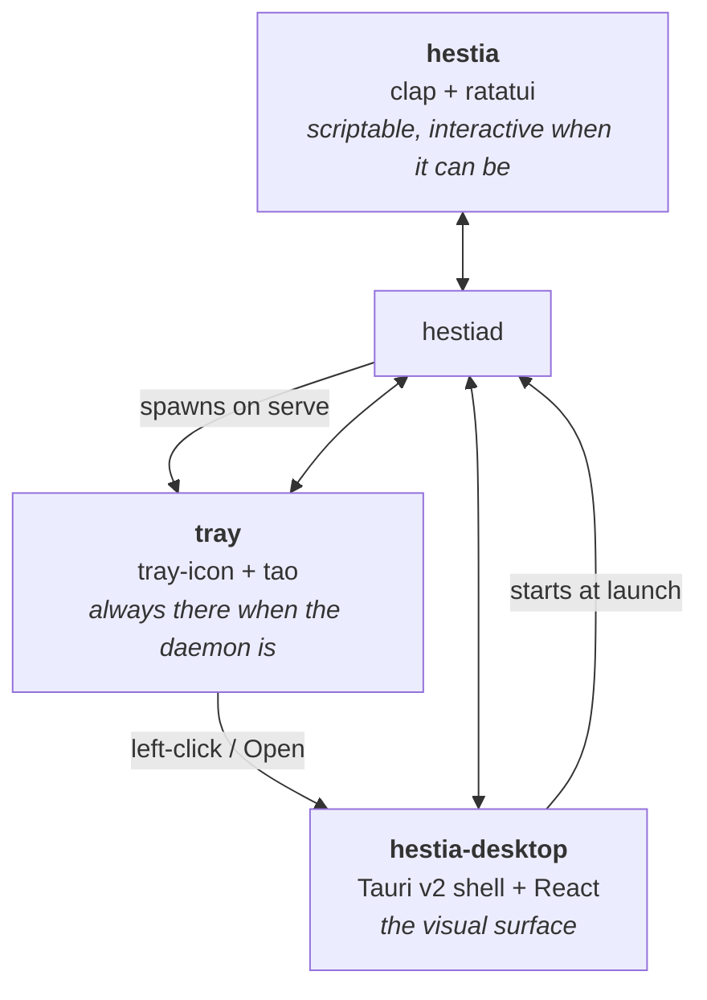
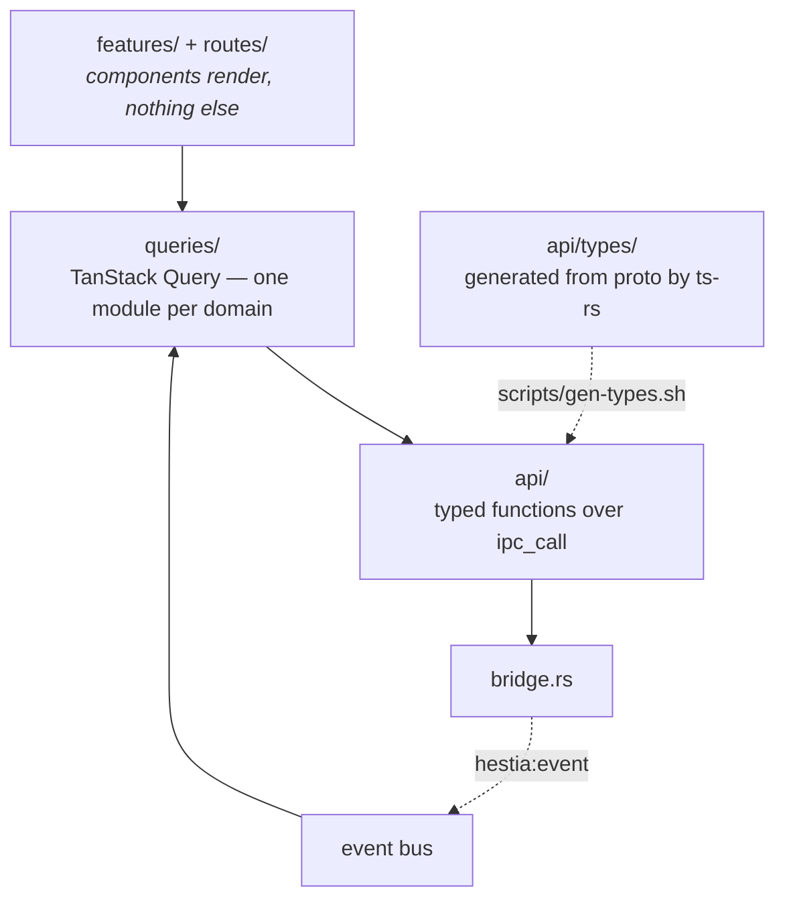

# Front-ends

*[← Architecture](../architecture.md)*

Three ways to drive one daemon. None of them links the engine; all of them go
through [`client`](wire.md#client--the-typed-sdk) over the socket.



Each front-end declares what it means by an ambiguous action rather than
inheriting a wire default: the CLI asks before stopping a daemon with workloads
running, while the tray and desktop leave workloads running, because a menu item
cannot ask ([0039](../decisions/0039-stopping-the-daemon-has-three-meanings.md)).

---

# CLI — `hestia`

A thin client built on clap's derive API. `main.rs` defines a `Command` enum;
each variant is a module under `commands/` exposing a `Subcommand` and a `run()`.
A domain with many verbs is a directory whose `mod.rs` holds only grammar and
dispatch.

The full user-facing reference is [cli.md](../cli.md); this covers how it is
built.

## Grammar

Noun-first and **entry-first**: catalogue verbs read `hestia server
create|list|versions|flavors`, but anything acting on a specific entry names it
once, right after the noun.

```
hestia server smp start
hestia server smp config set memory 4G
hestia server smp backup create
hestia instance modded mod add sodium
```

The name occupies one fixed slot instead of floating to a different position per
subcommand. clap models this with an `external_subcommand` variant on the noun's
`Subcommand`: an unrecognised first token — the entry name — is captured and
re-parsed by a `no_binary_name` parser, so per-entry actions keep full clap help
and validation while catalogue verbs stay ordinary subcommands.

Two cross-cutting shortcuts sit on top, earned by how often they are used:

- `hestia play [instance]` — the launcher's single most common action, picking
  interactively when several instances exist.
- verb-first `hestia start|stop|restart|logs|rename <name>` — resolves a name
  across *both* registries and dispatches, so day-to-day driving need not recall
  which kind an entry is, nor that `server start` and `instance launch` differ.

Everything scriptable still has an explicit noun-first form
([0043](../decisions/0043-entry-first-cli-grammar.md)).

Anything a `create` needs but wasn't given is asked for interactively — on a
terminal the picker *is* the browser; piped invocations error naming the flag to
pass, so scripts stay explicit.

**Every daemon capability gets a scriptable verb, or a written reason it has
none.** Skins and content profiles are the documented exceptions — both are
visual surfaces. A channel with no CLI verb is fine when the architecture says
why, and a bug when it does not
([0044](../decisions/0044-every-capability-gets-a-verb.md)).

## Connection and flags

Global `--verbose`/`--quiet`/`--home` sit on the root. `--home` is exported as
`$HESTIA_HOME` and only takes effect when `hestia daemon start` spawns the
daemon — a running daemon keeps its own directory.

No command auto-spawns: `connect()` and `connect_running()` require a running
daemon; `start()`, behind `daemon start`, is the one that spawns it.

`-vv` buys **wire visibility** rather than more volume — every frame with its
channel, correlation id, size and round-trip time. Payloads are never logged
([0045](../decisions/0045-vv-buys-wire-visibility.md)).

## Exit codes

A state query answers through its exit code, in systemd's vocabulary
(`cli/src/exit.rs`):

| Code | Meaning |
|---|---|
| 0 | did what was asked / the subject is running |
| 3 | answered, and the subject is **not** running |
| 1 | the command failed |
| 2 | usage (clap's own) |

Only the verbs that *assert* one subject's running-ness produce 3 — `daemon
status`, `server <name> status`. Verbs that merely describe stay 0, because
"inactive" is not a claim they make
([0046](../decisions/0046-state-queries-answer-through-exit-codes.md)).

## Presentation

Commands **never print directly**. They build a `View` (`Line`, `Note`,
`Detail`, `Table`, `Warning`) and hand it to `ui::show`, which owns all output.

Interactive surfaces run as **fullscreen sessions** on a small framework:

- `ui/session/` owns the terminal lifecycle — an RAII `TerminalGuard` for raw
  mode and the alternate screen, released on drop including on panic — plus the
  event loop (50 ms poll, drain-before-redraw, dirty-flag drawing, resize
  re-wrap) and the 80×24 minimum-size notice.
- A surface implements the `Screen` trait (`draw`, `on_key`, `on_mouse`,
  `on_event`, `tick`) and composes `ui/components/`: `TextInput`, `SelectList`,
  `LogView`, the searchable `Picker`, the in-session progress gauge.
- A session with async input (daemon events, search results) is fed through an
  mpsc channel by a driver future the command runs alongside it. Its outcome
  prints plainly to stdout after the terminal is restored, so scrollback keeps a
  record.

Anything that takes keys owns the whole alternate screen for as long as it runs.
Progress with **no** interaction is the deliberate exception — one stderr line
rewritten in place, since flashing the alternate screen for a spinner you cannot
act on is hostile ([0047](../decisions/0047-fullscreen-interaction-inline-progress.md)).

Piped or redirected, every surface degrades to plain text and widgets degrade to
arguments, so output stays scriptable.

This is also the seam for the planned TUI: bare `hestia` prints help today, but
the intended end state is a full-screen TUI over the same `Screen`s and `View`s.

---

# Desktop — `hestia-desktop`

A Tauri v2 shell hosting the React frontend in the root `frontend/`, wired to the
daemon through the same one-way boundary as the CLI.

## The Rust shell is a pipe

The whole wiring is one seam, `src/bridge.rs`:

- a shared `Client` held as Tauri managed state, started at shell launch — so
  opening the app brings its daemon up;
- **one generic** `ipc_call(channel, payload, timeout_ms)` command forwarding
  through the session's `call_raw`;
- event forwarding: on connect the bridge claims the session's one
  event-callback slot, subscribes to *every* daemon event, and re-emits each as a
  `hestia:event` webview event.

Mirroring ~120 channels as individual Tauri commands would add a third naming
seam that can drift from both sides while adding no safety — `invoke()` results
are untyped JSON regardless, and the daemon already validates every payload
through the wire contract. So the typed layer lives once, in TypeScript
([0049](../decisions/0049-desktop-bridge-is-one-generic-command.md)).

A watcher task notices a lost daemon between calls, emits `hestia:connection`
transitions, and passively reconnects. **Reconnection never spawns** — a daemon
stopped during the session was stopped on purpose. While the connection is down
the bridge answers `connection_lost` from held state rather than attempting the
socket, so a burst of reads costs one socket attempt per watch interval
([0053](../decisions/0053-offline-is-one-state.md)).

Everything else in `commands/` is there because it **cannot** be a daemon call —
each needs something only the shell process has:

| Command | Why it is not generic |
|---|---|
| `account_login_sisu` (`auth.rs`) | Microsoft sign-in opens in a native webview window and completes by reading that window's URL on redirect. A cross-origin webview's location is readable only from Rust ([0051](../decisions/0051-sisu-sign-in-is-a-shell-command.md)) |
| `prefs_list\|set\|remove` (`prefs.rs`) | UI state is the front-end's concern, so it never crosses the socket — written directly to `<data_home>/prefs.json`, resolving the same data home the engine uses ([0052](../decisions/0052-desktop-prefs-live-in-the-data-home.md)) |
| `icons_list`, `icon_set\|remove` (`icons.rs`) | a picked image is copied to `<data_home>/icons/<entry-id>.<ext>` so it survives the original moving. The webview loads them over the asset protocol, whose scope is widened to that directory per call, since the data home can move at runtime |
| `crash_list\|read\|clear`, `crash_report`, `log_write` (`diagnostics.rs`) | a webview error kills the UI without touching the Rust stack, so the shell records it into the same crash directory the daemon writes to. `log_write` routes console logging into the process `tracing` subscriber under the `ui` target |
| `changelog`, `update_check\|install` (`update.rs`) | installing an update replaces the running binary — `tauri-plugin-updater`'s job, not the daemon's. Release notes are compiled in from `CHANGELOG.md`, deliberately local so the shell can show them on the first run *after* an update |
| `start_daemon` (`bridge.rs`) | the `Client::start()` spawn path behind the offline overlay's start button |

## The frontend



**`api/`** — `core/` holds the `ipc_call` wrapper with the SDK's timeout
defaults, the event bus, and a `runJob` driver mirroring `Session::run_job`
(client-generated job id, subscribe-before-start). `types/` is **generated** from
`proto` by ts-rs; the feature-gated `#[ts]` derives never enter a production
build. Then one module per domain, mirroring the client facades.

**`queries/`** — one module per domain, mirroring the API namespaces 1:1. Each
exports **factories** — options objects, not hooks (`serverQueries.detail(id)`,
`serverMutations.start(id)`) — passed to TanStack's own `useQuery`/`useMutation`.
One definition then serves a component, a route loader's `ensureQueryData` and an
imperative fetch alike. A named hook is added only where a factory cannot express
it: a read composing two sources (`useServer`, `useDaemon`) or one accumulating
live events (`useServerLogs`, `useProcessMetrics`).

- Keys come from one hierarchical factory, always keyed by **stable entry ids**,
  never the renameable display name, with an entry's sub-resources nested under
  its `detail(id)` prefix so one sweep refreshes the whole entry.
- Long-running operations are **job mutations** routed through a global job
  store, so an activity surface sees every in-flight job with live progress,
  surviving unmount and navigation.
- Freshness is belt-and-suspenders: mutations invalidate their own key prefixes
  on settle, and `queries/invalidation.ts` maps terminal daemon topics to key
  prefixes, so changes made by the CLI, the tray or a schedule land without
  polling. A reconnect invalidates everything.
- Streaming is hooks too — `useConnection()`, `useDaemonEvent(topic, handler)`,
  and log hooks that accumulate `process.output` onto the fetched tail. Components
  never touch the event bus.

[hooks.md](../hooks.md) is the usage guide for this layer.

**`features/` and `routes/`** — pages for the library, servers, instances,
content browse, profiles, skins, news and settings, over a shared app shell with
an offline overlay, a first-run sign-in prompt and route guards for the
account-gated instance surface.

## Browser dev — the fixture daemon

`frontend/src/mock/` fakes `window.__TAURI_INTERNALS__` so the UI runs under a
plain `vite dev` with no shell and no `hestiad` behind it. It is installed from
`main.tsx` only in a dev build, and only when the real shell is absent, so it
never reaches a desktop bundle.

It is laid out like the thing it replaces, one module per domain on each side:

| In the mock | Stands in for |
|---|---|
| `state/` | `crates/engine` — the mutable world (entries, content pools, processes, worlds, settings) |
| `channels/` | `crates/daemon/src/services/` — one registrar per domain |
| `commands/` | `crates/desktop/src/commands/` plus the bundled Tauri plugins |
| `router.ts` | the daemon's router and the shell's `ipc_call` bridge |
| `job.ts`, `bus.ts` | the job managers and the event hub |

It is a **stateful** fake, because the two things a canned response cannot do
are the two that matter in dev: a create must show up in the list it was made
from, and a job must **settle** — `runJob` blocks until a terminal event
arrives, so a fixture that answers the start call and publishes nothing hangs
the caller forever. Jobs here walk their phases on a timer, publish progress,
and settle; a started entry registers a supervised process and broadcasts
`process.started` / `.output` / `.metrics` / `.exit` like the supervisor does.
Fixtures are typed against the generated `proto` mirrors, so a wire change fails
the typecheck here rather than silently serving a stale shape. An unlisted
channel is not an error: it answers with an empty-proxy value that degrades
instead of crashing the page, and warns to the console.

## Messages

The catalogue (paraglide/inlang, `frontend/messages/`) is organised on **one
axis — where the string is rendered** — and split one file per root:

| Root | What goes in it |
|---|---|
| `app.*` | shell chrome and shared vocabulary — nav, window, action, label, status, toast, search, time, jobs, validation, daemon |
| `<feature>.*` | one root per `frontend/src/features/` directory |
| `domain.*` | vocabulary mirroring a `proto` enum — content kinds, flavors, gamemodes, difficulties, provision phases, entry types |
| `error.*` / `warning.*` | the daemon's own vocabulary, keyed by variant, looked up dynamically |

Nest with objects rather than underscores — paraglide flattens a dotted key to
underscores, so `entry_settings.x` and `entry.settings_x` would compile to one
identifier.

The guard is a test, not a convention (`frontend/tests/messages.test.ts`): every
locale must cover the base locale exactly and interpolate the same
`{placeholders}`, every referenced key must exist, and every defined key must
have a call site. Dynamically reached tables must be declared in
`DYNAMIC_PREFIXES` — an undeclared table is exactly what makes dead keys
unprovable ([0050](../decisions/0050-messages-organised-by-render-surface.md)).

---

# Tray

A resident helper on Tauri's own tray crates (gtk/StatusNotifier on Linux, native
on Windows), wearing the desktop app's icon so both front-ends share one face.

The menu is: **Open Hestia**, a status header (version + running/stopped), a
start/restart action, a start-at-login toggle bound to the reserved `autostart`
config key, and a quit that stops the daemon while leaving workloads running.

A worker thread polls the daemon every two seconds over the client SDK and
reports state changes to the event loop; menu actions travel back over an mpsc
channel, so the UI thread never blocks on the socket. Left-click launches the
desktop shell.

**The daemon spawns the tray; the tray outlives the daemon.** A stopped daemon is
exactly when the tray is most useful — the greyed status plus a start action — so
only its own Quit removes it. A duplicate spawn after a daemon restart is
absorbed by an exclusive lock keyed by endpoint, so a dev daemon's tray and the
session's tray coexist ([0054](../decisions/0054-the-daemon-spawns-the-tray.md)).

Single-instance is enforced deliberately in each front-end: the tray by that
runtime lock, the desktop by `tauri-plugin-single-instance`, which focuses the
existing window rather than opening another. They must not share a GApplication
id, or on Linux each would block the other
([0055](../decisions/0055-tray-and-desktop-app-ids.md)).

## Decisions

- [0043 — Entry-first, with verb-first shortcuts for the hot path](../decisions/0043-entry-first-cli-grammar.md)
- [0044 — Every daemon capability gets a scriptable verb, or a written reason](../decisions/0044-every-capability-gets-a-verb.md)
- [0045 — `-vv` buys wire visibility, not more volume](../decisions/0045-vv-buys-wire-visibility.md)
- [0046 — A state query answers through its exit code](../decisions/0046-state-queries-answer-through-exit-codes.md)
- [0047 — Interaction is fullscreen; bare progress is one line](../decisions/0047-fullscreen-interaction-inline-progress.md)
- [0049 — The desktop bridge is one generic command](../decisions/0049-desktop-bridge-is-one-generic-command.md)
- [0050 — Messages are organised by render surface](../decisions/0050-messages-organised-by-render-surface.md)
- [0051 — Sign-in is the one bespoke shell command](../decisions/0051-sisu-sign-in-is-a-shell-command.md)
- [0052 — Front-end preferences are desktop-local](../decisions/0052-desktop-prefs-live-in-the-data-home.md)
- [0053 — Offline is one state, not a failure per read](../decisions/0053-offline-is-one-state.md)
- [0054 — The daemon spawns the tray; the tray outlives the daemon](../decisions/0054-the-daemon-spawns-the-tray.md)
- [0055 — The tray and desktop must not share a GApplication id](../decisions/0055-tray-and-desktop-app-ids.md)
