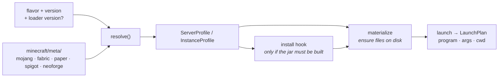

# Minecraft providers

*[← Architecture](../architecture.md)*

The `minecraft` subsystem answers three questions: **which distributions can you
run**, **which versions of each**, and **what exactly does launching one
require**. Everything downstream — provisioning a server, launching an instance —
consumes its answers.

It is stateless: every result is fetched upstream, so it needs no data directory.

## Flavors

A *flavor* is a distribution of Minecraft. There are two registries — server and
client — so a flavor can serve one side only.

| Flavor | Server | Client | Loads | Notes |
|---|:--:|:--:|---|---|
| `vanilla` | ✓ | ✓ | — | Mojang's own |
| `fabric` | ✓ | ✓ | mods | loader version pinnable |
| `neoforge` | ✓ | ✓ | mods | game jar built locally from the installer |
| `paper` | ✓ | | plugins | ships tuned JVM flags per version |
| `folia` | ✓ | | plugins | regionised; plugins filtered strictly as `folia` |
| `spigot` | ✓ | | plugins | compiled on your machine with BuildTools |
| `bukkit` | ✓ | | plugins | likewise (CraftBukkit) |

A provider names itself (`id`, `name`, `summary`), lists the game versions it
supports, states what content its loader consumes (`loads`), declares any
prerequisites it needs on this machine (`requires`), and *resolves* a request
into a launch profile.

Two things follow, and both exist so that shipping a flavor is a daemon-side
change alone:

- **A flavor describes itself on the wire.** `Flavor` carries the `summary` a
  picker renders and the `accepts` set an entry of it would have — no front-end
  keeps a table ([0008](../decisions/0008-flavor-declares-accepted-content.md)).
- **A flavor states what it needs before you commit to it.** Spigot and
  CraftBukkit need `git`; the catalogue resolves missing prerequisites at build
  time, each with a name you would recognise and where to get it
  ([0006](../decisions/0006-flavor-states-its-requirements.md)).

Adding a flavor is one impl plus one registry line. The content flows never
change, because what an entry accepts is composed from the provider's `loads`
plus what the side reads for itself.

## Profiles — what a launch needs

`resolve()` turns *(flavor, version, optional loader version)* into a
**`ServerProfile`** or **`InstanceProfile`**: the primary artifact, libraries,
asset index, required Java major, main class, arguments, and — where a flavor
needs them — recommended JVM args and an args file.

Manifest parsing lives in `minecraft/meta/` — one module per upstream, each
deserializing that API's own JSON shape rather than pretending it is ours.

**Mojang's manifest is the ordering ground truth.** Whether one version is newer
than another — which decides whether an update is a downgrade — is judged by
position in Mojang's catalogue, never by parsing version strings. It also
supplies release/snapshot status that most upstreams never state.

## The launch pipeline

Three modules sit over the profiles:

**`materialize`** idempotently ensures profile pieces on disk, skipping what is
already there:

| Piece | Where it lands |
|---|---|
| single jars | the entry's `data/`, or `meta/versions/` |
| libraries | Maven layout under the shared `meta/libraries/` |
| assets | content-addressed — `meta/assets/indexes/<id>.json` + `meta/assets/objects/<hh>/<hash>` |

Everything is SHA-verified through `Downloader`, with a bounded number of
concurrent fetches. Because the roots are shared, a second instance on the same
version costs almost nothing.

**`launch`** is pure assembly of a **`LaunchPlan`** (program, args, cwd):
classpath joining and Mojang `${placeholder}` substitution for auth, paths and
names. No I/O — which is what makes it unit-testable, and it is unit-tested.

**`rcon`** is a minimal RCON client — connect, authenticate, one command per
call. It is the server console's transport, chosen because it is
re-establishable state that survives a daemon restart, where a stdin pipe is not
([0059](../decisions/0059-the-console-is-rcon-not-a-pipe.md)).

**`world.rs`** reads a save's own `level.dat` (gzipped NBT, via `fastnbt`) so a
world can describe itself rather than being reduced to a folder name
([0025](../decisions/0025-a-world-describes-itself.md)).

**`log4j.rs`** generates the per-session logging config each instance launch runs
under — Log4Shell-safe by construction
([0042](../decisions/0042-per-session-log4j-config.md)).

## Flavors that build their own jar

Two flavors cannot simply download the thing they run, so providers grew an
**`install` hook** rather than the launch flows branching on a flavor name. It is
idempotent on the built jar's presence, and each step is a cancellation
checkpoint.

### NeoForge

NeoForge publishes no metadata service and no patched jar. Everything comes out
of its installer jar on `maven.neoforged.net`, read in-process with the `zip`
crate: `version.json` is the launch profile, `install_profile.json` names a chain
of ten small Java tools, and running that chain locally produces the jar the
loader actually runs. A first create or launch therefore takes a few minutes.

The catalogue needs no service either — a NeoForge version *is* its game version
plus a build number, under two schemes split by Minecraft's move to calendar
versioning, with semver build metadata outranking that arithmetic. The 1.20.1
line is a separate maven artifact and a second catalogue source rather than a
parsing case. A NeoForge **server** has no launchable jar at all: it runs from a
generated argument file naming its module path
([0004](../decisions/0004-neoforge-builds-its-own-jar.md)).

### Spigot and CraftBukkit

Mojang's takedown means neither jar legally exists as a download. SpigotMC
publishes **BuildTools**, which clones the upstream repositories, decompiles the
vanilla server, applies the patch sets and compiles the result on your machine —
so a first create takes several minutes and needs `git` installed.

One build serves both flavors and every entry on that version: the work tree is
shared (`meta/spigot/`, outputs under `jars/<version>/`) and the jar is copied
into each entry's `data/`. The build runs as a **supervised workload**, so its
output is readable live, a cancel reaches the whole tree, and two creates racing
on one version join the same build ([0007](../decisions/0007-spigot-is-compiled-locally.md)).

### Paper and Folia

One self-contained jar per build, so a profile is the vanilla shape with the jar
swapped. PaperMC publishes many builds per game version, and a build number goes
in `loader_version` — the same slot Fabric's loader builds already use — rather
than growing a parallel concept. Unpinned resolves to the newest `STABLE` build,
falling back to the newest of any channel so a freshly released game version is
never uninstallable ([0005](../decisions/0005-paper-build-is-a-loader-version.md)).

Paper also publishes a tuned G1GC flag set per version, which the profile
carries. Those flags are the **last** fallback, beneath the entry's own
`jvm-args` and the launcher-wide `defaults.jvm-args` — and `server info` names
which layer supplied the flags a process is actually running with
([0009](../decisions/0009-flavor-recommends-jvm-flags.md)).

## Decisions

- [0004 — NeoForge's game jar is built, not downloaded](../decisions/0004-neoforge-builds-its-own-jar.md)
- [0005 — A Paper build is a loader version, and Mojang orders the catalogue](../decisions/0005-paper-build-is-a-loader-version.md)
- [0006 — A flavor states what it needs, before the user commits to it](../decisions/0006-flavor-states-its-requirements.md)
- [0007 — Spigot and CraftBukkit are compiled here](../decisions/0007-spigot-is-compiled-locally.md)
- [0008 — What an entry takes is a property of its flavor](../decisions/0008-flavor-declares-accepted-content.md)
- [0009 — A flavor may recommend JVM flags; the user still outranks it](../decisions/0009-flavor-recommends-jvm-flags.md)
