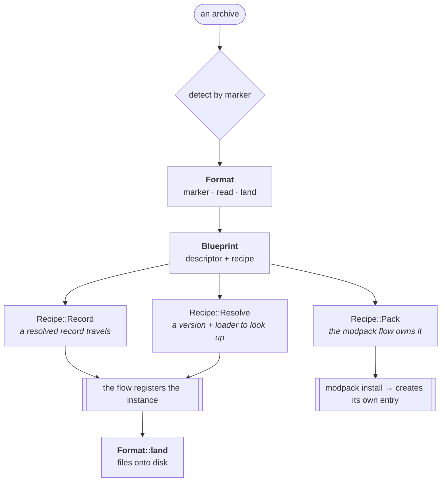

# Import & export

An instance moves in and out of the launcher as **one file**. This is what
instances have instead of backups, and the shape is different on purpose: a
server is infrastructure that must be recoverable *in place*, so it is archived
on a schedule under its own entry root; an instance is something you play,
share, and carry between machines, so its archive is one portable file you write
deliberately.

Three formats come in, two go out.

| Format | Marker | In | Out | What it is |
|---|---|---|---|---|
| **hestia** | `hestia.instance.json` | ✅ | ✅ | the whole entry directory + a resolved record — restores exactly, needs no network |
| **`.mrpack`** | `modrinth.index.json` | ✅ | ✅ | Modrinth's pack format: mods as *references*, everything else in `overrides/` |
| **Prism / MultiMC** | `instance.cfg` | ✅ | — | another launcher's instance directory (`mmc-pack.json` + `.minecraft/`) |

## Detection, not declaration

`hestia instance import <file>` takes a file and nothing else. Every one of these
formats is a zip and people rename them, so the format is decided by the **marker
file inside**, following Prism's own approach — someone handed an archive should
not have to know which launcher made it.

The **shallowest** marker wins, and the registry order only breaks a tie. Depth
has to come first: a pack index a Prism instance happens to ship inside its
`config/` is a file that instance *uses*, not what the archive *is*.

## The seam



A format answers three questions and nothing else: **which archives are mine**
(a marker), **what does this one say it is** (parse a manifest into a
[`Blueprint`]), and **where do the files go** (given an instance that now
exists). It never creates the instance — that is the launcher's job, and the
blueprint's `Recipe` says which of three routes applies.

Those three routes are a **closed set**; the formats are an open one. The flow
matches on the recipe, so a fourth format costs it nothing.

### Adding a format

One module under `crates/engine/src/transfer/` and one line in its registry
(`formats()` in `transfer/mod.rs`) — the same shape as adding a content platform
([0010](../decisions/0010-one-content-provider-trait.md)). A CurseForge or
ATLauncher importer would implement `Format`, pick `Recipe::Resolve`, and reuse
`transfer::pool::adopt` for the loose jars its game directory arrives with.

## What an archive carries

The exclusion rules are shared by every exporter
(`transfer/exclude.rs`) — "which files *are* the instance" is one question with
one answer, and two writers deciding it separately is how a format quietly ships
somebody's crash reports.

Left out, following Prism's own export defaults plus two of hestia's own:

| Skipped | Why |
|---|---|
| `logs/`, `data/logs`, `data/crash-reports` | regenerated, and large |
| `data/.cache`, `data/.fabric`, `data/.quilt` | loader caches, rebuilt on launch |
| `.DS_Store`, `thumbs.db`, `session.lock` | OS turds and a transient world lock |
| `*.part`, `.discard-*` | something was mid-write |
| `instance.json` | the record travels in the manifest instead |
| the `data/` **mirror** of a pool item | the managed copy is the record; the mirror is re-made at every launch ([0013](../decisions/0013-managed-dir-of-record.md)) |

**Saves are in.** An instance without its worlds is not the instance. A caller
can still leave any path out — `--exclude data/saves`, or unchecking it in the
desktop's tree — and `instance.export.contents` answers that tree, derived from
the *same file plan the export writes* so the two cannot disagree.

Symlinks are **followed**, unlike the server backup's tar: `data/saves` is
routinely a link into the shared `sync` store, and an archive carrying the link
rather than the worlds would have no game data in it.

## The hestia archive

The entry directory itself, plus a manifest that is also the marker:

```
cozy.hestia (a zip)
├── hestia.instance.json    the manifest: format version, who wrote it, the record
├── content.json            the pool index — provenance survives the trip
├── modpack.json            the pack the instance runs, when it runs one
├── mods/ resourcepacks/ shaderpacks/ datapacks/
├── profiles/               captured content profiles
└── data/                   the game directory: config, options.txt, saves
```

The record carries a **resolved** profile (client jar, libraries, asset index),
so importing one needs no network and cannot be broken by a version falling out
of a catalogue years later. The **id is not honoured**: an imported instance is a
new entry and gets a fresh one, so the same archive can be imported twice.

The marker is deliberately not called `instance.json` — a marker is a claim about
what an archive *is*, so it has to be specific enough that finding it inside
someone else's zip means something.

## The `.mrpack` export

A lossy projection, by nature: a pack names its mods by URL and hash, so only
pool items hestia knows the origin of survive as references. A local-file import
has no URL to write and rides along inside the archive instead, with a
`ExportFilesEmbedded` warning saying so — the export installs correctly either
way, it is just no longer a pack Modrinth would accept for publishing.

Each referenced file carries `sha1` (what the pool stores) **and** `sha512`
(what the format wants), hashed at export. A disabled item is exported as
`optional` rather than dropped, so whoever installs the pack gets the same
choice rather than a silently shorter mod list.

## Importing another launcher's instance

A Prism/MultiMC instance names a game version and a loader in `mmc-pack.json`
rather than resolving them, so the import resolves them exactly as
`instance create` does — and an archive pinning a loader hestia has no flavor for
is refused **by name** (`ArchiveUnsupported`), never silently installed as
vanilla. `instance.cfg` contributes the display name and, where that instance
overrode its launcher's defaults, its memory and JVM arguments.

Its `.minecraft/` becomes `data/`, and the loose jars in it are **adopted into
the content pool** (`transfer/pool.rs`): moved to the managed directory, indexed,
and mirrored back. They carry no provenance — the archive is their only source —
so the import returns `ImportFilesUntracked` saying they can never be updated. A
`.disabled` suffix becomes hestia's `enabled` flag, which is the same fact
spelled the way this launcher spells it.

## An import is a create

It registers a new instance and then fills it, so it owns the discipline every
other create has: **an import that fails partway removes the entry it started**.
A registered instance whose files never landed is worse than no instance — it
lists, it cannot launch, and nobody asked for it.

An export is guarded like a backup: the instance must be stopped and racing no
content, pack or transfer job, since all of those write the tree it reads. While
one runs, the things that would rewrite that tree underneath it — a launch's
content mirror, a content install, a rename, a remove — are refused. An import
guards nothing, because the entry it would conflict with is the one it creates.

## Where an archive goes

`instance.export` takes an absolute destination: a file, a directory (a name is
generated inside it), or empty for `<data_home>/exports/`. **Relative paths are
refused** — the daemon is a separate process and does not share a client's
working directory, so a relative path would mean something different on each
side of the socket. The CLI resolves against its own cwd before sending.

The desktop registers `.hestia` with the OS, so a double-clicked archive reaches
the app — as a launch argument, or through single-instance when a window is
already up — and opens the import dialog on it.

## Related decisions

- [0061 — An archive format is a module, not a branch](../decisions/0061-an-archive-format-is-a-module.md)
- [0013 — The managed dir is the record](../decisions/0013-managed-dir-of-record.md)
- [0011 — A modpack decomposes into existing parts](../decisions/0011-modpack-decomposes-into-existing-parts.md)
- [0024 — Backups follow docker-mc-backup](../decisions/0024-backups-follow-docker-mc-backup.md)
