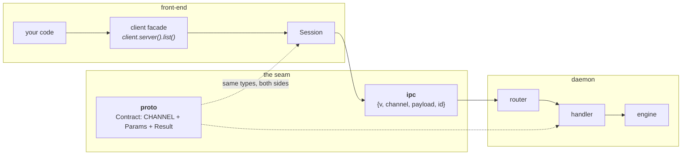
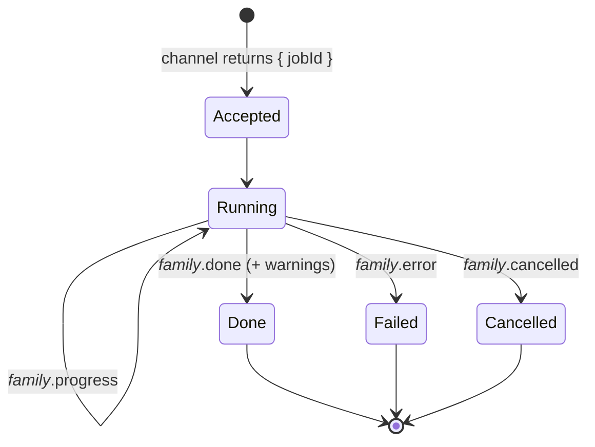

# The socket boundary

*[← Architecture](../architecture.md)*

Everything a front-end does crosses one seam. Three crates own it: **`proto`**
defines the payloads, **`ipc`** carries the bytes, and **`client`** is the typed
SDK every front-end drives the daemon through.

The point of the seam is that there is exactly **one** definition per channel,
shared by both sides. A daemon handler and a client call marshal through the
same Rust types, so they cannot disagree — a mismatch is a compile error, not a
runtime surprise.



## `proto` — the contracts

Pure data. No I/O, no async; `serde` derive is the codec. A **`Contract`** names
its channel once and pairs it with its request and response types:

```rust
pub trait Contract {
    const CHANNEL: &'static str;
    type Params: Serialize + DeserializeOwned;
    type Result: Serialize + DeserializeOwned;
}
```

An unsolicited daemon→client push is a **`Topic`** — the implementing type *is*
its payload. `Empty` is the `{}` payload for channels that take or return
nothing.

One module per domain: `app`, `health`, `daemon`, `config`, `cache`, `download`,
`java`, `accounts`, `skins`, `process`, `server`, `instance`, `backup`,
`content`, `modpack`, `profile`, `sync`, `announce`, `update`, `job`, `events`.
Three are shared vocabularies rather than domains of their own:

- **`minecraft`** — what the `server` and `instance` domains have in common:
  `Flavor`, `GameVersion`, `Artifact`, the launch profiles, `ProvisionProgress`.
- **`content`** — the normalized third-party content vocabulary
  (`ContentProject` with its images, `ContentVersion`, the paginated
  `SearchQuery`/`SearchResult`, `ResolvedModpack`). A front-end never sees a
  platform's raw shape.
- **`naming`** — the rules both sides must apply identically: how a user's
  reference resolves to an entry (`reference_matches`), and how supervisor
  process keys are spelled (`process_in_scope`).

Also `error::ErrorInfo` and `warning::WarningInfo` — structured, exhaustive
vocabularies, so no failure or caveat is prose authored at a call site.

**The wire is camelCase.** Every fielded proto struct carries
`#[serde(rename_all = "camelCase")]`; Rust field names stay `snake_case` and
only the serialized form is renamed, so the webview consumes payloads with no
key conversion. Enum variant *values* stay `snake_case`/`lowercase`, because the
frontend's string-literal union types depend on them. `tests/casing.rs` fails
the build if a new serialized struct omits the attribute. The one deliberate
exception is the `config.*` key vocabulary, which stays kebab-case
([0031](../decisions/0031-camelcase-except-the-config-vocabulary.md)).

Adding a channel is a struct plus an `impl Contract` — see
[contributing.md](../contributing.md).

## `ipc` — transport and envelope

Carries bytes and nothing domain-specific.

| Module | What it owns |
|---|---|
| `transport.rs` | the platform socket (Unix domain socket / Windows named pipe), `bind`/`connect`, a length-framed `FrameReader`/`FrameWriter`, and `Peer` — the connection's verified identity (`uid` and `authorized()` on POSIX via peer credentials) |
| `protocol.rs` | the JSON envelope, encoded and decoded in exactly one place. Request `{v, channel, payload, id?}`, response `{v, ok, payload \| error, id?}`, event `{event, payload}` |
| `endpoint.rs` | where the socket lives — `$XDG_RUNTIME_DIR/hestia/hestiad.sock`, else `/tmp/hestia-<uid>/…`; a named pipe on Windows. `HESTIA_SOCK` overrides it so tests and side-by-side daemons never collide |
| `errors.rs` | the error-code vocabulary (`BAD_REQUEST`, `NOT_FOUND`, `UNKNOWN_CHANNEL`, `HANDLER_ERROR`, `VERSION_MISMATCH`, `UNAUTHORIZED`, …) and the client-facing `IpcError` |

The **runtime directory** holding the ephemeral socket is deliberately distinct
from the engine's persistent data home: one is where a running daemon can be
reached, the other is where your data lives.

`PROTOCOL_VERSION` is `1`, same-major only, and the decode functions refuse to
construct a frame at all for a foreign or missing version — the check cannot be
forgotten at a call site
([0001](../decisions/0001-envelope-fails-closed.md)).

## `client` — the typed SDK

The one way a front-end drives the daemon.

- `Client::connect()` opens a connection to a **running** daemon. It never
  spawns.
- `Client::start()` is the sole path that spawns `hestiad` if it isn't running —
  backing the deliberate start actions (CLI `daemon start`, the tray, the
  desktop's start button and launch).
- `connect_to(endpoint)` targets an explicit socket.

**`Session`** (`session.rs`) is the connection core, private to the crate: one
persistent, multiplexed connection whose background reader task fulfils pending
requests by id and delivers events to an installed callback.

| Call | Behaviour |
|---|---|
| `call::<C>()` | marshals through the contract, returns the `proto` result |
| `try_call::<C>()` | maps a `not_found` to `None` |
| `call_with_timeout::<C>()` | overrides the 10 s default for a long call |
| `run_job::<C>()` | drives a long-running operation, forwarding progress events and blocking until a terminal topic arrives |
| `call_raw()` | the untyped forward the desktop bridge pipes through |

**Facades** (`facades/`) are one struct per domain, reached through a `Client`
accessor (`client.java().install(21, …)`), mirroring the engine's domain modules
on the other side of the socket. Methods are one-liners over `Session`.
`facades/jobs.rs` holds the drivers the server and instance facades share, since
backup and content jobs publish the same topics disambiguated by job id.

`spawn.rs` locates and launches the `hestiad` binary, then retries the connection
until it is listening.

Session also carries the **wire trace** — a `trace!` per frame sent and
received with its channel, correlation id, byte size and round-trip time, plus
connection transitions. That is what the CLI's `-vv` buys, for every front-end
that links `client`. Payloads are never logged
([0045](../decisions/0045-vv-buys-wire-visibility.md)).

> **One event-callback slot per session.** `run_job` and `subscribe` both claim
> it, so a driver must serialize event-driven calls — plain request/response
> calls may interleave freely, but one job runs at a time
> ([0048](../decisions/0048-one-event-callback-per-session.md)).

## Jobs, events and cancellation

Anything that can take minutes — a download, a Java install, a server create, a
backup, a content install, a modpack apply — is a **job**. The channel answers
immediately with a job id, and the work streams events under that id.



Every family names its terminal topics alike, so a driver derives them from the
done topic. Cancellation is an **explicit act** — one `job.cancel { id }`
channel — and inside the engine it is cooperative and checkpointed, never a
kill: stopping at a checkpoint leaves exactly what a network failure at the same
point would have left, so the existing failure paths do the cleanup. A cancelled
job is not an error ([0035](../decisions/0035-jobs-are-cancelled-by-asking.md)).

A client subscribes with `events.subscribe`, filtered by id. The filter also
covers *session keys beneath* an entry key, which is what lets one subscription
follow an instance across launches
([0040](../decisions/0040-following-logs-is-entry-scoped.md)).

## Failures and warnings

Two structured vocabularies, same discipline:

- **`ErrorInfo`** — the operation did not happen. Mapped to an `ipc::errors` code
  at the service boundary, with the structured variant carried alongside so a
  front-end can render it precisely (`ContentKindRejected` names the accepted
  set; `MissingRequirement` names the tool and where to get it;
  `ModpackEntryMismatch` names both sides).
- **`WarningInfo`** — the operation *did* happen, but something degraded. Carried
  on job done events and on the standing views that stay true afterwards
  (`ServerDetails`, so `server info` keeps saying it long after the create
  scrolled past).

Every warning variant carries a `hint()` beside its `Display` headline: a
warning you cannot act on is noise, so the remediation is part of the type
rather than something each front-end invents. And a warning about something the
*launcher* did wrong is a bug to fix, not text to soften
([0029](../decisions/0029-degraded-outcomes-ride-on-the-result.md),
[0030](../decisions/0030-warnings-the-user-did-not-cause.md)).

## Decisions

- [0001 — The envelope seam fails closed](../decisions/0001-envelope-fails-closed.md)
- [0029 — A degraded outcome rides on the result](../decisions/0029-degraded-outcomes-ride-on-the-result.md)
- [0030 — A warning the user did not cause is a bug](../decisions/0030-warnings-the-user-did-not-cause.md)
- [0031 — camelCase everywhere, except the `config.*` vocabulary](../decisions/0031-camelcase-except-the-config-vocabulary.md)
- [0035 — A job is cancelled by asking](../decisions/0035-jobs-are-cancelled-by-asking.md)
- [0048 — One event-callback slot per session](../decisions/0048-one-event-callback-per-session.md)
