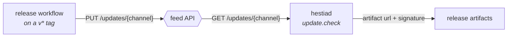

# The update feed — contract

The API every installed copy polls for a new version, and the one endpoint CI
publishes to. Two parties, one document:



Nothing reads GitHub to decide what is current — the feed is the record. The
artifacts themselves still live wherever the manifest's `url` points, and the
daemon verifies every one against its compiled-in minisign keys, so the API is
trusted to say *which* version, never to be the source of the bytes.

The API is the `apps/api` workspace of
[hestia-web](https://github.com/prytaneum/hestia-web); its live reference is at
`/docs` and its OpenAPI document at `/openapi.json`.

## The envelope

Every response that API produces — success or failure, this endpoint or any
other — is wrapped:

```json
{ "success": true, "message": "Current release", "data": { … } }
```

```json
{ "success": false, "message": "…", "code": "SERVICE_UNAVAILABLE" }
```

So the manifest arrives under `data`, which is where `engine::update` reads it
from. A failure carries no `data` at all; the daemon never gets that far,
because it rejects on the status line first.

## Channels

`stable` and `beta`, and the set is closed — an unknown channel is rejected, not
served as an empty feed. The channel is the last path segment; there is one
manifest per channel and they are independent documents.

Which channel a release belongs to is decided by its tag: a semver prerelease
suffix (`v1.3.0-beta.1`) is `beta`, a plain `v1.3.0` is `stable`.

## `GET /updates/{channel}`

Public, unauthenticated, cacheable. Answers the manifest most recently published
to that channel.

| Status | `code` | When |
|---|---|---|
| `200` | — | a manifest has been published; it is in `data` |
| `422` | `VALIDATION_FAILED` | `{channel}` is not `stable` or `beta` |
| `503` | `SERVICE_UNAVAILABLE` | the channel exists but nothing has been published yet |

The daemon treats every non-200 as "cannot check for updates" and never as "you
are up to date", so an empty channel must not answer `200` with a null version.

The answer carries `Cache-Control: public, max-age=300`. The daemon does not
depend on it, but every installed copy polls this.

## `PUT /updates/{channel}`

The publish. Idempotent by design — the body *replaces* the channel's manifest,
so a re-run of a release job is harmless and a rollback is a re-publish of the
older document.

```
x-api-key: <token>
Content-Type: application/json
```

| Status | `code` | When |
|---|---|---|
| `200` | — | published; `data` is `{channel, version, publishedAt}` |
| `401` | `UNAUTHORIZED` | missing or unrecognised token |
| `403` | `FORBIDDEN` | the caller is not an admin, or presented a session instead of a token |
| `422` | `VALIDATION_FAILED` | `{channel}` is unknown, or the body is not a valid manifest |

The credential is an API token minted for an admin account — `UPDATE_FEED_TOKEN`
in the release workflow. A browser session is deliberately refused: publishing is
a machine operation, and scoping it to a revocable token keeps a stolen cookie
from moving what every install downloads.

Publishing is the only privileged operation, and there is no route that deletes a
channel. A channel is emptied by publishing over it, never by removing it.

## The manifest

Unchanged from what the release workflow already composes, and unchanged from
what the daemon already parses. Fields neither side knows are **preserved**, not
stripped, so the document is additive in both directions.

```json
{
  "version": "1.3.0",
  "channel": "stable",
  "notes": "…markdown, from the CHANGELOG section for this version…",
  "pub_date": "2026-08-06T12:00:00Z",
  "platforms": {
    "windows-x86_64": {
      "url": "https://…/Hestia_1.3.0_x64-setup.exe",
      "signature": "<base64 minisign>"
    },
    "linux-x86_64": {
      "url": "https://…/Hestia-1.3.0.AppImage",
      "signature": "<base64 minisign>",
      "formats": {
        "deb": { "url": "https://…/hestia_1.3.0_amd64.deb", "signature": "…" },
        "rpm": { "url": "https://…/hestia-1.3.0-1.x86_64.rpm", "signature": "…" }
      }
    }
  }
}
```

| Field | Required | Meaning |
|---|---|---|
| `version` | yes | semver. The daemon compares it against its own by full semver precedence, prerelease included |
| `channel` | no | which feed this document belongs to. The path decides it; a body that disagrees is overwritten |
| `notes` | no | markdown, rendered by the desktop after an upgrade. Defaults to `""`, never null |
| `pub_date` | no | RFC 3339. Not read by the daemon |
| `platforms` | yes | keyed `{os}-{arch}` in Rust's `consts` spelling (`linux-x86_64`, `windows-x86_64`) |

A platform's top-level `url`/`signature` is its **default** artifact — the NSIS
setup, the AppImage. `formats` carries the rest, keyed by install shape (`deb`,
`rpm`). A build asks only for the format matching how it was installed and never
substitutes: a deb install offered no `deb` entry reports "no artifact for this
install" rather than downloading something it cannot apply.

### What publishing rejects

A bad manifest is otherwise only noticed by users, so the API refuses one:

- `version` is not semver
- `platforms` is empty, or a key is not `{os}-{arch}`
- an artifact is missing `url` or `signature`, at either level
- a `url` is not `https` — the signature makes an install safe, but plaintext
  still exposes which version every machine is on
- a `signature` is not base64 — `scripts/sign.sh` writes base64 around the whole
  minisign document, which is the only form
  `engine::signature::verify_bytes` decodes

## What is *not* in the contract

- **Signature verification.** The daemon checks every artifact against keys
  compiled into it, so a compromised feed cannot cause an unsigned install — it
  can at most withhold updates or offer an older signed one.
- **Which artifact to download.** The install shape is detected on the client;
  the feed offers all of them and never chooses.
- **Whether the version is an upgrade.** The feed states what is current; the
  daemon decides. Publishing an older version to a channel is a rollback for new
  installs, not a downgrade command to existing ones.

## Testing it

The daemon takes `HESTIA_UPDATE_ENDPOINT` in **debug** builds, standing in for
the whole URL — channel segment included — alongside `HESTIA_UPDATE_PUBKEY` for
the key to trust. `scripts/update.sh --serve` compiles a signed fake manifest,
wraps it in the same envelope the API answers with, and serves it, so the client
half is exercisable with no API at all.
